# Block Diagram — 分层模块图

> 📋 模板说明：在此文件中按技术分层展示系统架构。
> 建议分为 6~8 层，从上到下：前端 → API → 业务 → 数据 → 监控 → 基础设施。
> 🤖 生成器填入位：从下面第一个 ```mermaid 块开始覆写，保留 ## 子图N 标题格式，参见 AGENT.md。

## 分层全景 — 多层架构总览

```mermaid
flowchart TB
    subgraph L1["🖥️ L1 前端展示"]
        direction LR
        FE1["Web 端<br/>PC / 响应式"]
        FE2["移动端<br/>H5 / Mini App"]
        FE3["管理后台<br/>运营配置"]
        FE_VENDOR["UI库 · 状态管理 · 请求库"]
    end

    subgraph L2["🔌 L2 API 接入层"]
        direction LR
        GW["API 网关<br/>鉴权 · 限流 · 路由"]
        BFF["BFF 聚合层<br/>面向前端的聚合API"]
        OPEN["开放平台 API<br/>签名鉴权 · 配额"]
    end

    subgraph L3["⚙️ L3 调度与控制"]
        direction LR
        SCH["任务调度<br/>Cron · 事件触发"]
        WF["工作流引擎<br/>状态机 · 编排"]
        CMD["命令总线<br/>CQRS 写端"]
    end

    subgraph L4["🧩 L4 业务服务层"]
        direction LR
        SVC_A["业务域A<br/>模块/服务"]
        SVC_B["业务域B<br/>模块/服务"]
        SVC_C["业务域C<br/>模块/服务"]
        DOMAIN["领域模型<br/>聚合根 · 实体 · VO"]
    end

    subgraph L5["📊 L5 数据处理层"]
        direction LR
        AGG["数据聚合<br/>Join · 汇总"]
        CACHE["缓存层<br/>多级缓存 · 穿透/击穿防护"]
        ETL["ETL 管道<br/>清洗 · 转换 · 加载"]
    end

    subgraph L6["💾 L6 数据存储层"]
        direction LR
        DB_RDB[("关系型 DB<br/>MySQL / PostgreSQL")]
        DB_NOSQL[("NoSQL<br/>MongoDB / ES")]
        DB_KV[("KV 缓存<br/>Redis")]
        DB_MQ[("消息队列<br/>Kafka / RabbitMQ")]
        DB_FS[("文件/对象存储<br/>S3 / OSS")]
    end

    subgraph L7["🔔 L7 监控与运维"]
        direction LR
        METRIC["指标采集<br/>Prometheus"]
        LOG["日志中心<br/>ELK / Loki"]
        TRACE["链路追踪<br/>Jaeger / SkyWalking"]
        ALERT["告警平台<br/>规则 · 多渠道通知"]
    end

    subgraph L8["📦 L8 基础设施"]
        direction LR
        K8S["K8s / 容器<br/>编排 · 弹性伸缩"]
        CI_CD["CI/CD 流水线<br/>构建 · 测试 · 发布"]
        SEC["安全组件<br/>WAF · 漏扫 · 审计"]
    end

    L1 -->|"HTTP"| L2
    L2 -->|"RPC / HTTP"| L3
    L2 -->|"RPC / HTTP"| L4
    L3 -->|"调度"| L4
    L4 -->|"读写"| L5
    L5 -->|"读写"| L6
    L4 -.->|"生产消息"| DB_MQ
    L7 -->|"采集"| L2
    L7 -->|"采集"| L3
    L7 -->|"采集"| L4
    L8 -->|"支撑"| L1
    L8 -->|"支撑"| L2
    L8 -->|"支撑"| L6
    L8 -->|"支撑"| L7

    classDef fe fill:#e3f2fd,stroke:#1565c0,stroke-width:2px
    classDef api fill:#e8eaf6,stroke:#283593,stroke-width:2px
    classDef sch fill:#fff3e0,stroke:#e65100,stroke-width:2.5px
    classDef biz fill:#e8f5e9,stroke:#2e7d32,stroke-width:2px
    classDef data fill:#e0f2f1,stroke:#00695c,stroke-width:2px
    classDef store fill:#efebe9,stroke:#5d4037,stroke-width:2px
    classDef mon fill:#fff8e1,stroke:#f57f17,stroke-width:2px
    classDef infra fill:#eceff1,stroke:#546e7a,stroke-width:1.5px,stroke-dasharray:5 5

    class FE1,FE2,FE3,FE_VENDOR fe
    class GW,BFF,OPEN api
    class SCH,WF,CMD sch
    class SVC_A,SVC_B,SVC_C,DOMAIN biz
    class AGG,CACHE,ETL data
    class DB_RDB,DB_NOSQL,DB_KV,DB_MQ,DB_FS store
    class METRIC,LOG,TRACE,ALERT mon
    class K8S,CI_CD,SEC infra

    style L1 fill:#fce4ec,stroke:#c2185b,stroke-width:3px
    style L2 fill:#e8eaf6,stroke:#3949ab,stroke-width:2.5px
    style L3 fill:#fff3e0,stroke:#ef6c00,stroke-width:2.5px
    style L4 fill:#e8f5e9,stroke:#43a047,stroke-width:2px
    style L5 fill:#e1f5fe,stroke:#0288d1,stroke-width:2px
    style L6 fill:#e0f2f1,stroke:#00796b,stroke-width:2px
    style L7 fill:#fffde7,stroke:#fbc02d,stroke-width:2.5px
    style L8 fill:#f5f5f5,stroke:#9e9e9e,stroke-width:1.5px,stroke-dasharray:3 3
```



---

*模板文件 · 请替换为你项目的实际内容*
