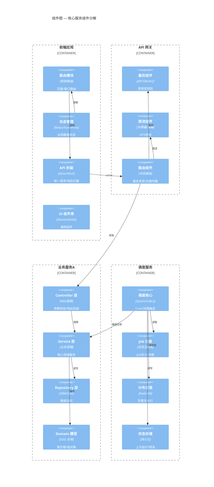
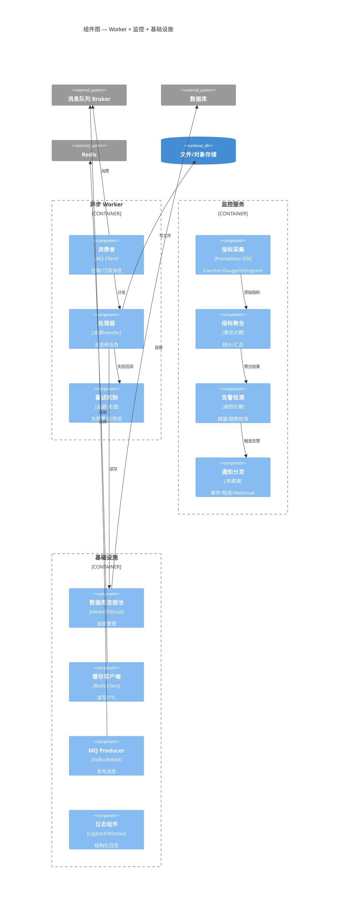

# C4 Component — 组件详情图

> 📋 模板说明：在此文件中拆解容器内部的组件结构。
> 拆分为 2 张子图：核心服务组件 + 支撑组件。
> 🤖 生成器填入位：从下面第一个 ```mermaid 块开始覆写，保留 ## 子图N 标题格式，参见 AGENT.md。

## 子图1：核心服务 — 网关 + 业务服务 + 调度引擎



## 子图2：支撑组件 — Worker + 监控 + 基础设施



---

*模板文件 · 请替换为你项目的实际内容*
