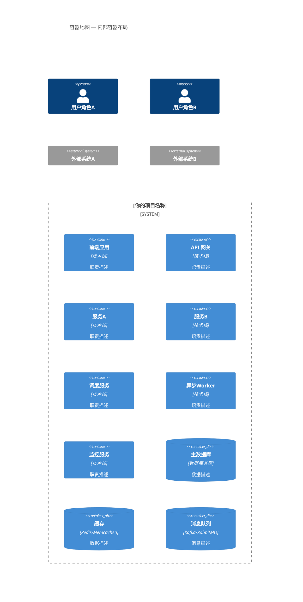
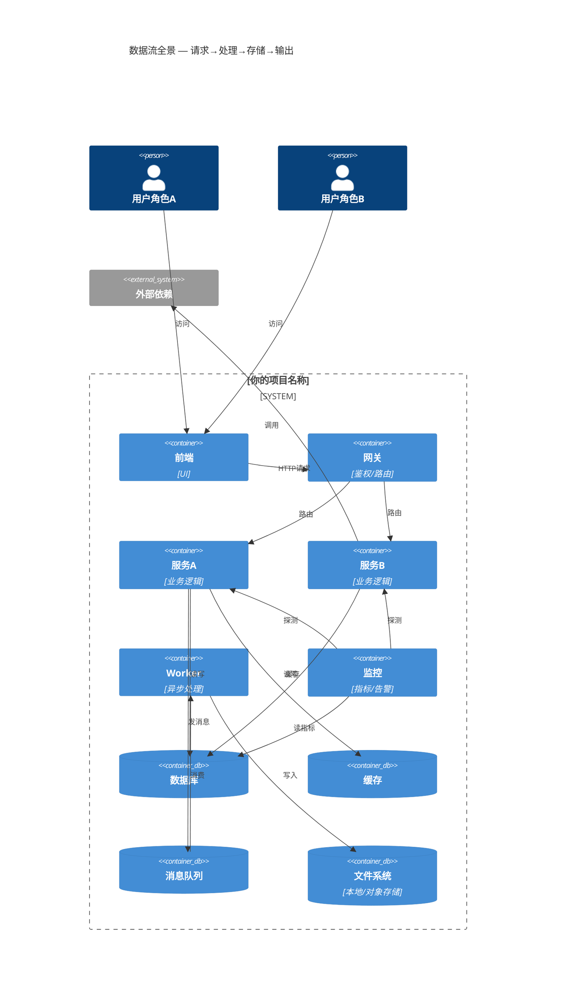

# C4 Container — 容器视图

> 📋 模板说明：在此文件中描述系统内部的主要容器（运行时进程/服务）及其职责划分。
> 拆分为 2 张子图：容器地图一览 + 数据流全景。
> 🤖 生成器填入位：从下面第一个 ```mermaid 块开始覆写，保留 ## 子图N 标题格式，参见 AGENT.md。

## 子图1： 🔄 容器地图 — 内部容器布局



## 子图2：数据流全景 — 请求→处理→存储→输出



---

*模板文件 · 请替换为你项目的实际内容*
