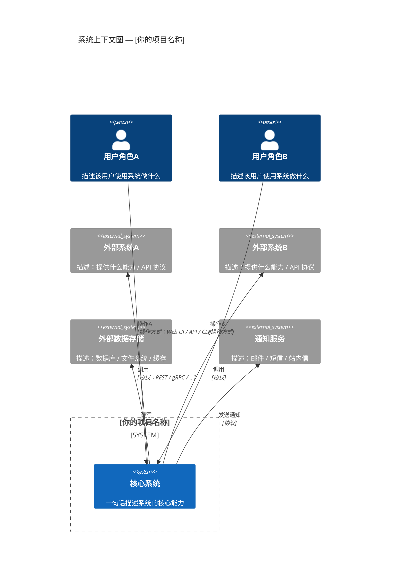
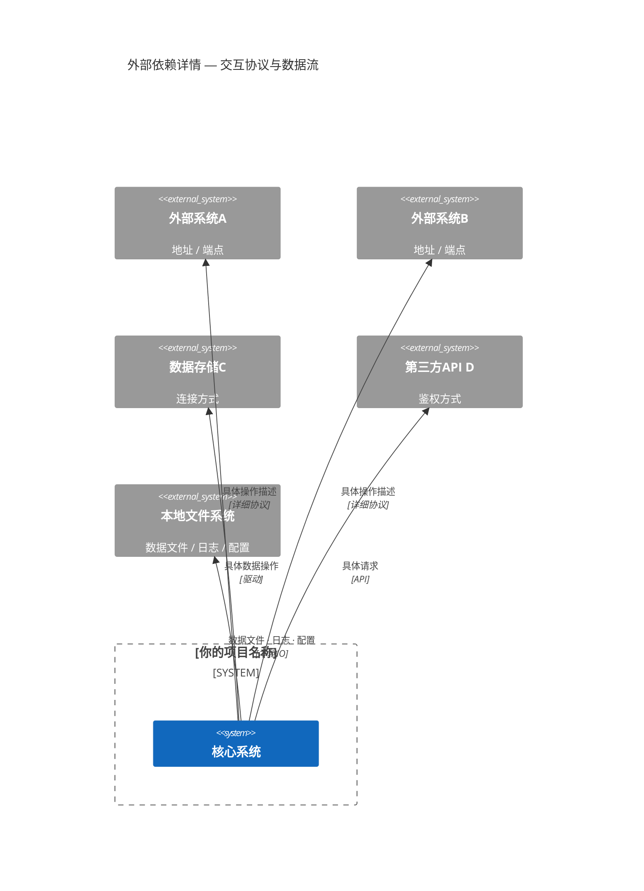

# C4 System Context — 系统上下文图

> 📋 模板说明：在此文件中描述你的项目在业务环境中的定位、用户角色及外部系统交互。
> 拆分为 2 张子图：系统全景一览 + 外部依赖详情。
> 将下方示例代码替换为你的实际项目内容。
> 🤖 生成器填入位：从下面第一个 ```mermaid 块开始覆写，保留 ## 子图N 标题格式，参见 AGENT.md。

## 子图1： 🔄 系统全景 — 用户与外部系统一览



## 子图2： 🔄 外部依赖详情 — 交互协议与数据分类



---

*模板文件 · 请替换为你项目的实际内容*
