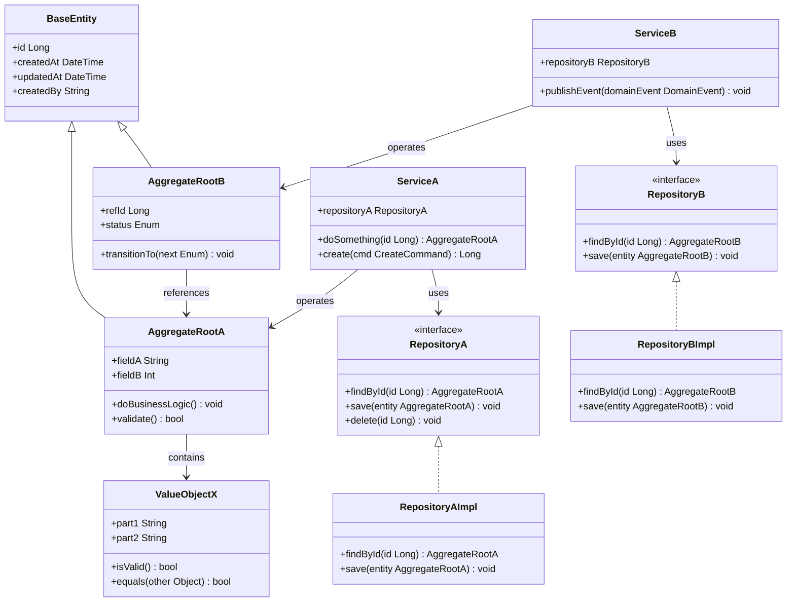
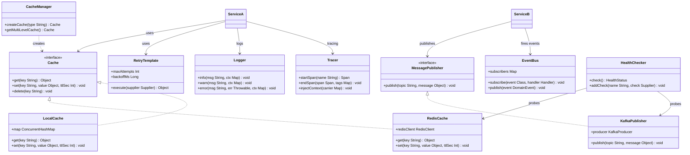

# Class Diagram — 核心类结构图

> 📋 模板说明：在此文件中展示后端核心类及其关系。
> 按模块拆分为 2 张子图：业务核心类 + 基础支撑类。
> 🤖 生成器填入位：从下面第一个 ```mermaid 块开始覆写，保留 ## 子图N 标题格式，参见 AGENT.md。

## 子图1：业务核心类 — 领域模型 + 服务类



## 子图2：基础支撑类 — 基础设施 + 横切关注点



---

*模板文件 · 请替换为你项目的实际内容*
