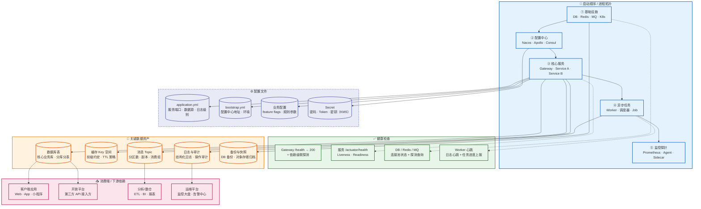

# Deployment & Operations View — 部署运维图

> 📋 模板说明：在此文件中展示运行时进程拓扑、数据资产、配置结构与健康检查。
> 运维关注的 5 大要素：启动顺序 · 健康检查 · 配置文件 · 数据资产 · 消费端。
> 🤖 生成器填入位：从下面第一个 ```mermaid 块开始覆写，保留 ## 子图N 标题格式，参见 AGENT.md。

## 进程与数据总览



---

*模板文件 · 请替换为你项目的实际内容*
