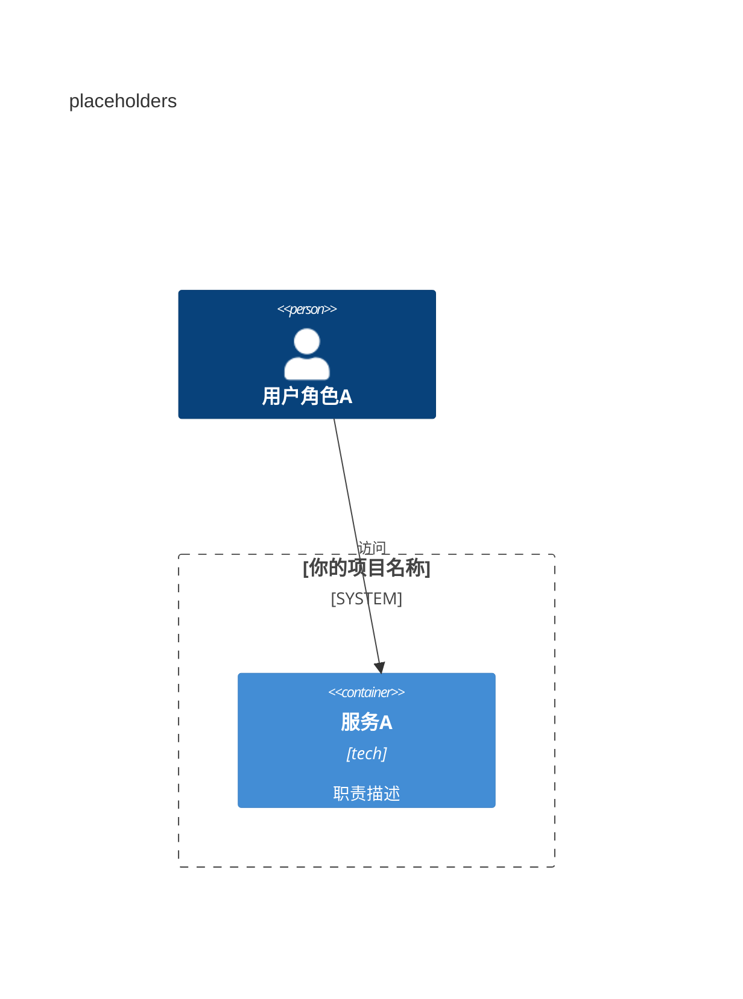

# C4 Container — drift demo (intentionally broken)

## 子图1：未声明 Rel

```mermaid
C4Container
    title broken

    Person(user, "user")
    System_Boundary(platform, "demo") {
        Container(web, "web", "html", "")
    }

    Rel(user, web, "ok")
    Rel(web, ghost_service, "this id is not declared")

    UpdateLayoutConfig($c4ShapeInRow="3", $c4BoundaryInRow="1")
```

## 子图2：占位未填



---

*模板文件 · 请替换为你项目的实际内容*
