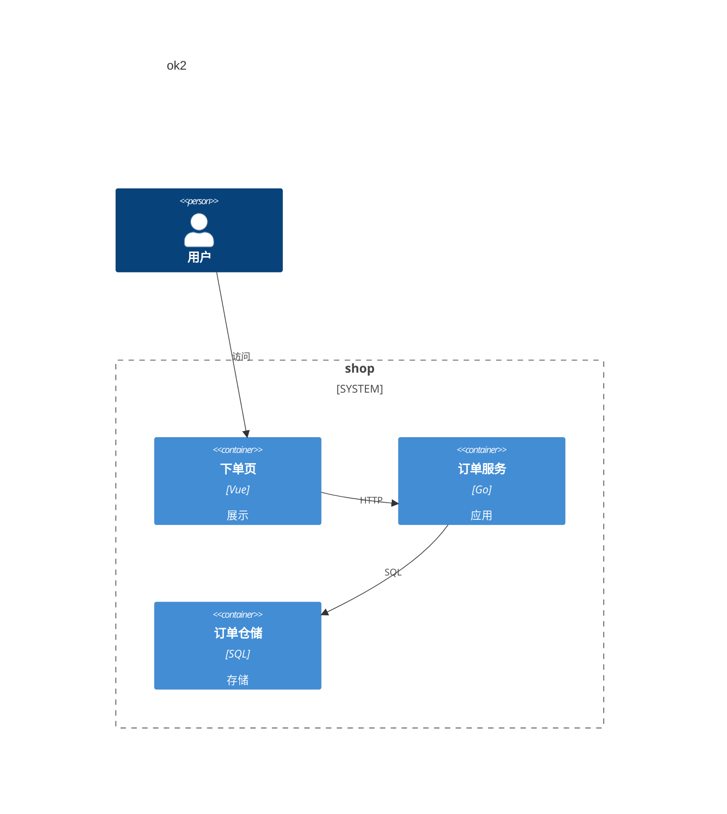

# C4 Container — rules ok

## 子图1：经 service 中转

```mermaid
C4Container
    title ok

    Person(user, "用户")
    System_Boundary(platform, "shop") {
        Container(web_page, "下单页", "Vue", "展示")
        Container(order_service, "订单服务", "Go", "应用")
        Container(order_repo, "订单仓储", "SQL", "存储")
    }

    Rel(user, web_page, "访问")
    Rel(web_page, order_service, "HTTP")
    Rel(order_service, order_repo, "SQL")

    UpdateLayoutConfig($c4ShapeInRow="3", $c4BoundaryInRow="1")
```

## 子图2：协作

```mermaid
C4Container
    title ok2

    Person(user, "用户")
    System_Boundary(platform, "shop") {
        Container(web_page, "下单页", "Vue", "展示")
        Container(order_service, "订单服务", "Go", "应用")
        Container(order_repo, "订单仓储", "SQL", "存储")
    }

    Rel(user, web_page, "访问")
    Rel(web_page, order_service, "HTTP")
    Rel(order_service, order_repo, "SQL")

    UpdateLayoutConfig($c4ShapeInRow="3", $c4BoundaryInRow="1")
```

---

*rules ok fixture*
