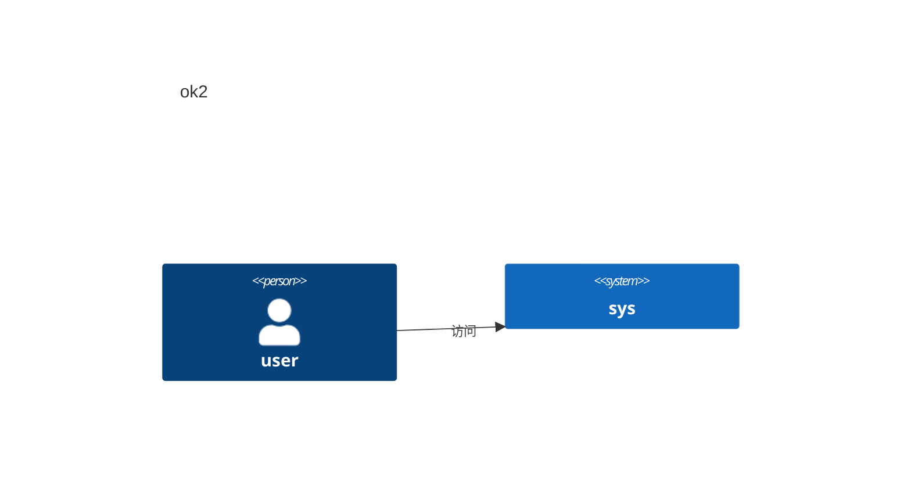

# stub

## 子图1：ok

```mermaid
C4Context
    title ok
    Person(user, "user")
    System(sys, "sys", "")
    Rel(user, sys, "访问")
    UpdateLayoutConfig($c4ShapeInRow="3", $c4BoundaryInRow="1")
```

## 子图2：ok2

```mermaid
C4Context
    title ok2
    Person(user, "user")
    System(sys, "sys", "")
    Rel(user, sys, "访问")
    UpdateLayoutConfig($c4ShapeInRow="3", $c4BoundaryInRow="1")
```

---

*generated stub*
