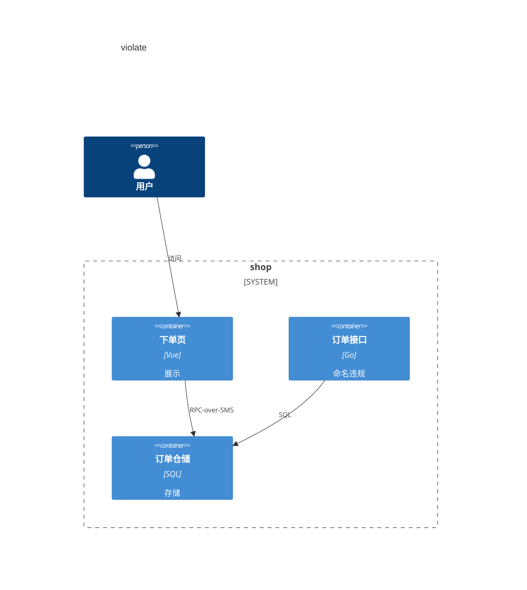
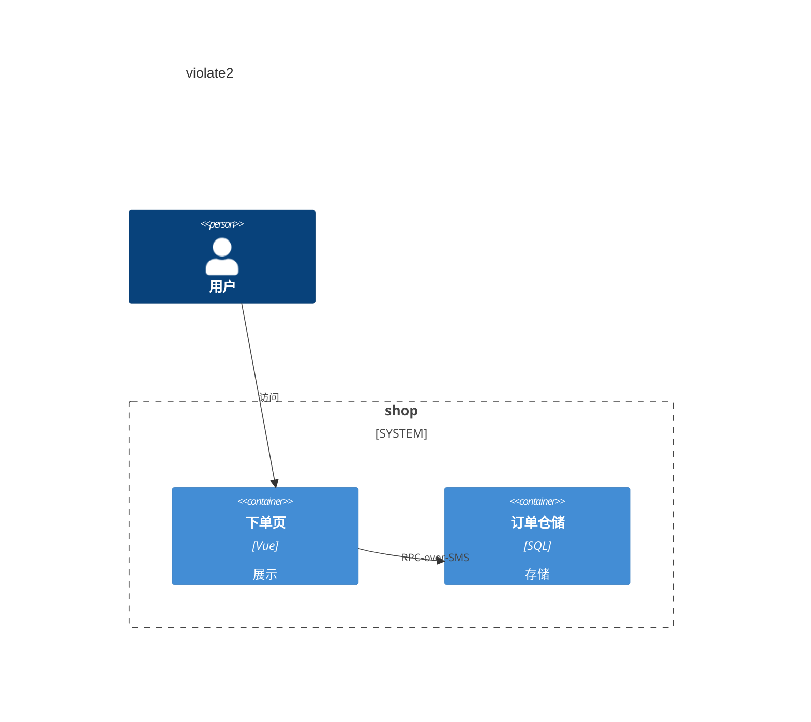

# C4 Container — rules violate (intentionally broken team rules)

## 子图1：跨层 + 非法 Rel 标签

```mermaid
C4Container
    title violate

    Person(user, "用户")
    System_Boundary(platform, "shop") {
        Container(web_page, "下单页", "Vue", "展示")
        Container(OrderAPI, "订单接口", "Go", "命名违规")
        Container(order_repo, "订单仓储", "SQL", "存储")
    }

    Rel(user, web_page, "访问")
    Rel(web_page, order_repo, "RPC-over-SMS")
    Rel(OrderAPI, order_repo, "SQL")

    UpdateLayoutConfig($c4ShapeInRow="3", $c4BoundaryInRow="1")
```

## 子图2：同上

```mermaid
C4Container
    title violate2

    Person(user, "用户")
    System_Boundary(platform, "shop") {
        Container(web_page, "下单页", "Vue", "展示")
        Container(order_repo, "订单仓储", "SQL", "存储")
    }

    Rel(user, web_page, "访问")
    Rel(web_page, order_repo, "RPC-over-SMS")

    UpdateLayoutConfig($c4ShapeInRow="3", $c4BoundaryInRow="1")
```

---

*rules violate fixture*
