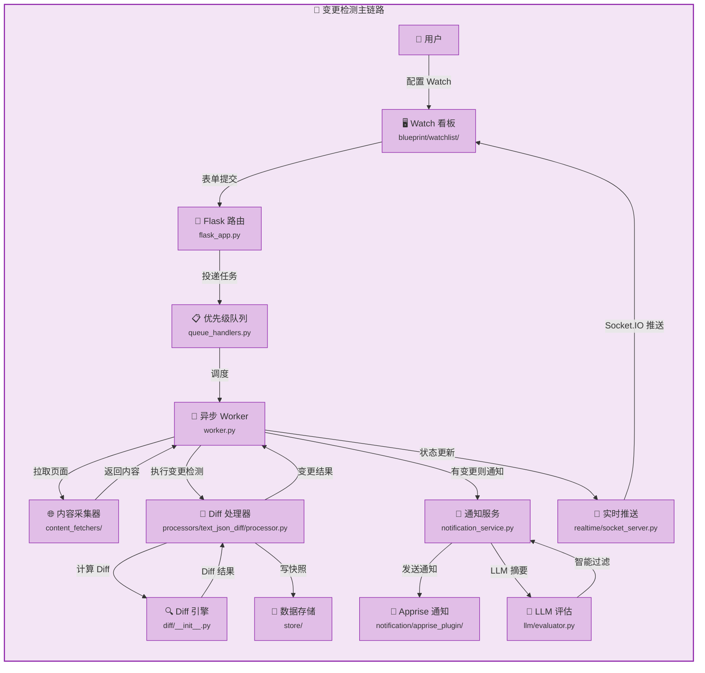

# changedetection.io 分层模块主视图（block-diagram.md）

## 子图1：分层全景（7 层）

```mermaid
flowchart TB
    subgraph L_frontend["🖥️ 前端展示层"]
        direction TB
        ui_watchlist["🛒 Watch 看板<br/><small>blueprint/watchlist/</small>"]
        ui_edit["✏️ 编辑 Watch<br/><small>blueprint/ui/edit.py</small>"]
        ui_diff["📊 Diff 对比<br/><small>blueprint/ui/diff.py</small>"]
        ui_preview["👁️ 预览<br/><small>blueprint/ui/preview.py</small>"]
        static_js["⚙️ 前端 JS<br/><small>static/js/</small>"]
    end

    subgraph L_api["🔌 后端 API 层"]
        direction TB
        flask_app["🚀 Flask 应用<br/><small>flask_app.py</small>"]
        api_watch["📡 Watch API<br/><small>api/Watch.py</small>"]
        api_search["🔍 搜索 API<br/><small>api/Search.py</small>"]
        api_import["📥 导入 API<br/><small>api/Import.py</small>"]
        api_notifications["🔔 通知 API<br/><small>api/Notifications.py</small>"]
        api_spec["📜 OpenAPI Spec<br/><small>api/Spec.py</small>"]
    end

    subgraph L_schedule["⏰ 调度核心层"]
        direction TB
        queue_handlers["📋 优先级队列<br/><small>queue_handlers.py</small>"]
        custom_queue["🔢 信号队列<br/><small>custom_queue.py</small>"]
        queued_meta["📦 队列元数据<br/><small>queuedWatchMetaData.py</small>"]
    end

    subgraph L_worker["⚙️ 采集 Worker 层"]
        direction TB
        worker_pool["👷 Worker 池<br/><small>worker_pool.py</small>"]
        worker_async["🔄 异步 Worker<br/><small>worker.py</small>"]
        fetcher_requests["🌐 HTTP 采集<br/><small>content_fetchers/requests.py</small>"]
        fetcher_playwright["🎭 Playwright 采集<br/><small>content_fetchers/playwright.py</small>"]
        fetcher_webdriver["🧭 WebDriver 采集<br/><small>content_fetchers/webdriver_selenium.py</small>"]
        processor_text["📝 文本 Diff 处理器<br/><small>processors/text_json_diff/</small>"]
        processor_restock["💰 补货/价格处理器<br/><small>processors/restock_diff/</small>"]
        processor_image["🖼️ 图像 Diff 处理器<br/><small>processors/image_ssim_diff/</small>"]
    end

    subgraph L_storage["💾 数据存储与持久化"]
        direction TB
        datastore["🗄️ 数据存储<br/><small>store/__init__.py</small>"]
        file_datastore["📁 文件型存储<br/><small>store/file_saving_datastore.py</small>"]
        watch_model["📋 Watch 模型<br/><small>model/Watch.py</small>"]
        app_model["⚙️ 应用模型<br/><small>model/App.py</small>"]
        persistence["💾 持久化 Mixin<br/><small>model/persistence.py</small>"]
    end

    subgraph L_monitor["📡 监控告警层"]
        direction TB
        notification_service["📨 通知服务<br/><small>notification_service.py</small>"]
        notification_handler["📤 通知处理器<br/><small>notification/handler.py</small>"]
        apprise_plugin["🔌 Apprise 插件<br/><small>notification/apprise_plugin/</small>"]
        realtime_socket["🔴 实时 Socket<br/><small>realtime/socket_server.py</small>"]
        realtime_events["⚡ 实时事件<br/><small>realtime/events.py</small>"]
    end

    subgraph L_ops["🚀 交付 / 运维层"]
        direction TB
        dockerfile["🐳 Dockerfile<br/><small>Dockerfile</small>"]
        docker_compose["📦 Docker Compose<br/><small>docker-compose.yml</small>"]
        entrypoint["🔧 入口脚本<br/><small>docker-entrypoint.sh</small>"]
        cli_entry["💻 CLI 入口<br/><small>changedetection.py</small>"]
    end

    %% 前端 → API
    ui_watchlist -->|"表单/REST 请求"| flask_app
    ui_edit -->|"表单/REST 请求"| flask_app
    ui_diff -->|"REST 请求"| flask_app
    ui_preview -->|"REST 请求"| flask_app
    static_js -->|"浏览器执行"| ui_watchlist

    %% API → 调度
    flask_app -->|"投递任务"| queue_handlers
    api_watch -->|"创建/更新 Watch"| flask_app
    api_search -->|"搜索请求"| flask_app
    api_import -->|"批量导入"| flask_app
    api_notifications -->|"通知配置"| flask_app
    api_spec -->|"API 文档"| flask_app

    %% 调度 → Worker
    queue_handlers -->|"调度任务"| worker_pool
    custom_queue -->|"信号通知"| queue_handlers
    queued_meta -->|"优先级数据"| queue_handlers

    %% Worker 内部
    worker_pool -->|"启动/管理"| worker_async
    worker_async -->|"调用采集器"| fetcher_requests
    worker_async -->|"调用采集器"| fetcher_playwright
    worker_async -->|"调用采集器"| fetcher_webdriver
    worker_async -->|"调用处理器"| processor_text
    worker_async -->|"调用处理器"| processor_restock
    worker_async -->|"调用处理器"| processor_image

    %% Worker → 存储
    worker_async -->|"读写 Watch 数据"| datastore
    processor_text -->|"读写快照"| datastore
    processor_restock -->|"读写价格数据"| datastore
    processor_image -->|"读写截图"| datastore

    %% 存储内部
    datastore -->|"继承/使用"| file_datastore
    file_datastore -->|"持久化"| watch_model
    file_datastore -->|"持久化"| app_model
    watch_model -->|"使用"| persistence
    app_model -->|"使用"| persistence

    %% Worker → 监控
    worker_async -->|"检测到变更"| notification_service
    processor_text -->|"变更结果"| notification_service
    processor_restock -->|"价格/库存变更"| notification_service
    processor_image -->|"视觉变更"| notification_service

    %% 监控内部
    notification_service -->|"格式化通知"| notification_handler
    notification_handler -->|"发送通知"| apprise_plugin
    notification_service -->|"实时推送"| realtime_socket
    realtime_socket -->|"事件处理"| realtime_events

    %% 交付 → 其他
    dockerfile -->|"构建镜像"| cli_entry
    docker_compose -->|"编排服务"| dockerfile
    entrypoint -->|"启动应用"| cli_entry
    cli_entry -->|"启动"| flask_app

    %% 样式
    style L_frontend fill:#fce4ec,stroke:#c2185b,stroke-width:2px
    style L_api fill:#ede7f6,stroke:#5e35b1,stroke-width:2px
    style L_schedule fill:#fff3e0,stroke:#ef6c00,stroke-width:2px
    style L_worker fill:#e8f5e9,stroke:#2e7d32,stroke-width:2px
    style L_storage fill:#e0f7fa,stroke:#00838f,stroke-width:2px
    style L_monitor fill:#fffde7,stroke:#f9a825,stroke-width:2px
    style L_ops fill:#c8e6c9,stroke:#1b5e20,stroke-width:2px

    classDef frontend fill:#f8bbd0,stroke:#c2185b,color:#333
    classDef api fill:#d1c4e9,stroke:#5e35b1,color:#333
    classDef schedule fill:#ffe0b2,stroke:#ef6c00,color:#333
    classDef worker fill:#c8e6c9,stroke:#2e7d32,color:#333
    classDef storage fill:#b2ebf2,stroke:#00838f,color:#333
    classDef monitor fill:#fff9c4,stroke:#f9a825,color:#333
    classDef ops fill:#a5d6a7,stroke:#1b5e20,color:#333

    class ui_watchlist,ui_edit,ui_diff,ui_preview,static_js frontend
    class flask_app,api_watch,api_search,api_import,api_notifications,api_spec api
    class queue_handlers,custom_queue,queued_meta schedule
    class worker_pool,worker_async,fetcher_requests,fetcher_playwright,fetcher_webdriver,processor_text,processor_restock,processor_image worker
    class datastore,file_datastore,watch_model,app_model,persistence storage
    class notification_service,notification_handler,apprise_plugin,realtime_socket,realtime_events monitor
    class dockerfile,docker_compose,entrypoint,cli_entry ops
```

## 子图2：变更检测主链路

---
**说明**：本图基于 changedetection.io 仓库源码绘制，所有节点路径均来自实际文件树。存储层采用文件型 JSON 存储（`store/file_saving_datastore.py`），非 SQLite/MySQL；通知通过 Apprise 库实现多通道推送；实时通信基于 Flask-SocketIO（`realtime/` 目录）。
