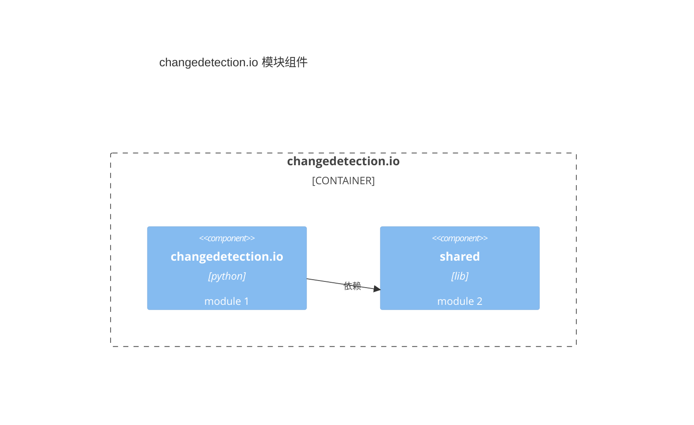
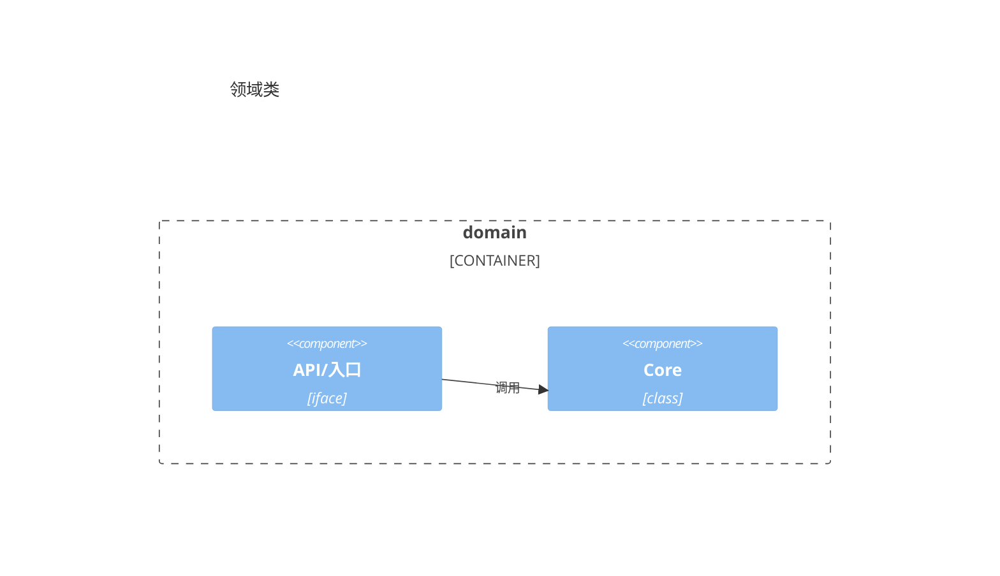

# C4 Component — 组件详情

## 子图1：模块组件

```mermaid
C4Component
    title changedetection.io 模块组件

    Container_Boundary(app, "changedetection.io") {
        Component(c_app_core, "changedetection.io", "python", "module 1")
        Component(c_shared_lib, "shared", "lib", "module 2")
    }

    Rel(c_app_core, c_shared_lib, "依赖")

    UpdateLayoutConfig($c4ShapeInRow="3", $c4BoundaryInRow="1")
```

## 子图2：领域类组件

```mermaid
C4Component
    title 领域类

    Container_Boundary(domain, "domain") {
        Component(boundary_api, "API/入口", "iface", "")
        Component(cls_core, "Core", "class", "")
    }

    Rel(boundary_api, cls_core, "调用")

    UpdateLayoutConfig($c4ShapeInRow="3", $c4BoundaryInRow="1")
```

---

*由 Architecture Viewer Community Generate 根据仓库扫描生成 · 请人工审阅后提交*
