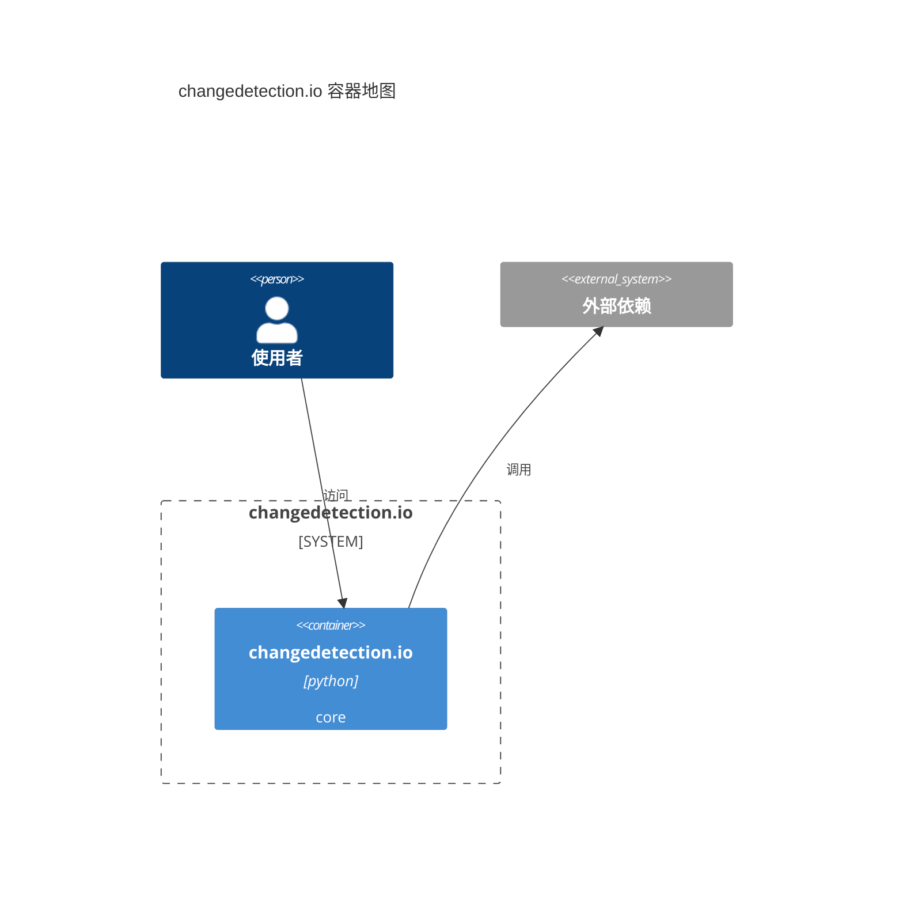

# C4 Container — 容器视图

## 子图1：内部容器布局

```mermaid
C4Container
    title changedetection.io 容器地图

    Person(user, "使用者")

    System_Boundary(platform, "changedetection.io") {
        Container(app_core, "changedetection.io", "python", "core")
    }

    System_Ext(ext_dep, "外部依赖")

    Rel(user, app_core, "访问")
    Rel(app_core, ext_dep, "调用")

    UpdateLayoutConfig($c4ShapeInRow="3", $c4BoundaryInRow="1")
```

## 子图2：协作数据流

```mermaid
C4Container
    title 容器协作

    Person(user, "使用者")

    System_Boundary(platform, "changedetection.io") {
        Container(app_core, "changedetection.io", "python", "core")
    }

    System_Ext(ext_dep, "外部依赖")

    Rel(user, app_core, "访问")
    Rel(app_core, ext_dep, "调用")

    UpdateLayoutConfig($c4ShapeInRow="3", $c4BoundaryInRow="1")
```

---

*由 Architecture Viewer Community Generate 根据仓库扫描生成 · 请人工审阅后提交*
