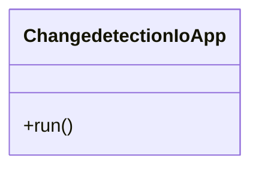
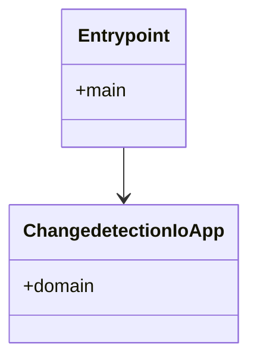

# Class Diagram — 代码结构

## 子图1：扫描到的类型

```mermaid
classDiagram
  class ChangedetectionIoApp {
    +run()
  }

```

## 子图2：入口关系

```mermaid
classDiagram
  class Entrypoint {
    +main
  }
  class ChangedetectionIoApp {
    +domain
  }
  Entrypoint --> ChangedetectionIoApp
```

---

*由 Architecture Viewer Community Generate 根据仓库扫描生成 · 请人工审阅后提交*
