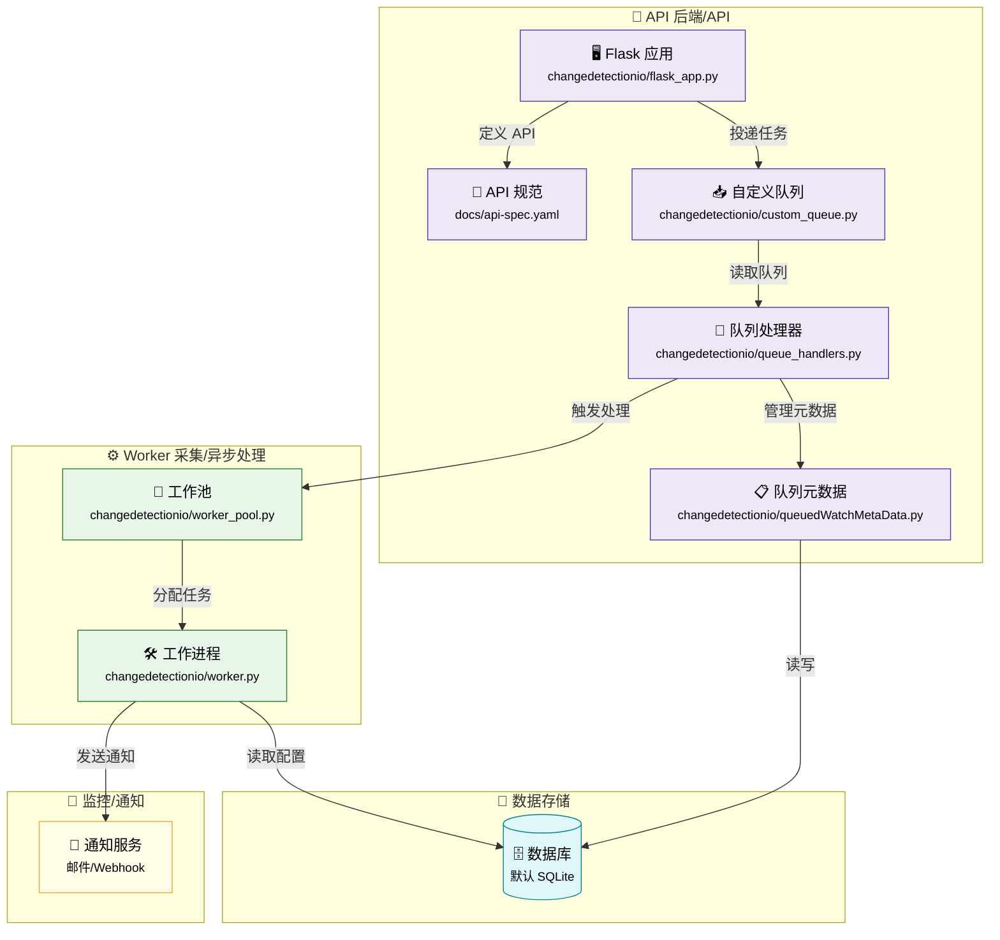

# Block Diagram — 分层模块

本图展示 changedetection.io 的核心分层架构，聚焦于 API 层与 Worker 层的交互，以及数据存储与监控通知的支撑。

## 子图1：分层全景

```mermaid
flowchart TB
    subgraph L_api["🔌 API 后端/API"]
        direction LR
        flask_app["🖥️ Flask 应用<br/><small>changedetectionio/flask_app.py</small>"]
        api_spec["📜 API 规范<br/><small>docs/api-spec.yaml</small>"]
        custom_queue["📥 自定义队列<br/><small>changedetectionio/custom_queue.py</small>"]
        queue_handlers["🔧 队列处理器<br/><small>changedetectionio/queue_handlers.py</small>"]
        queued_meta["📋 队列元数据<br/><small>changedetectionio/queuedWatchMetaData.py</small>"]
    end

    subgraph L_worker["⚙️ Worker 采集/异步处理"]
        direction LR
        worker["🛠️ 工作进程<br/><small>changedetectionio/worker.py</small>"]
        worker_pool["👥 工作池<br/><small>changedetectionio/worker_pool.py</small>"]
    end

    subgraph L_storage["💾 数据存储"]
        direction LR
        db[("🗄️ 数据库<br/><small>默认 SQLite</small>")]
    end

    subgraph L_monitor["📢 监控/通知"]
        direction LR
        notify["🔔 通知服务<br/><small>邮件/Webhook</small>"]
    end

    flask_app -->|"定义 API"| api_spec
    flask_app -->|"投递任务"| custom_queue
    custom_queue -->|"读取队列"| queue_handlers
    queue_handlers -->|"管理元数据"| queued_meta
    queued_meta -->|"读写"| db
    queue_handlers -->|"触发处理"| worker_pool
    worker_pool -->|"分配任务"| worker
    worker -->|"读取配置"| db
    worker -->|"发送通知"| notify

    classDef apiColor fill:#ede7f6,stroke:#5e35b1,color:#000
    classDef workerColor fill:#e8f5e9,stroke:#2e7d32,color:#000
    classDef storageColor fill:#e0f7fa,stroke:#00838f,color:#000
    classDef monitorColor fill:#fffde7,stroke:#f9a825,color:#000

    class flask_app,api_spec,custom_queue,queue_handlers,queued_meta apiColor
    class worker,worker_pool workerColor
    class db storageColor
    class notify monitorColor
```

---
*由 Architecture Viewer 编排流水线生成 · 已过事实核查*