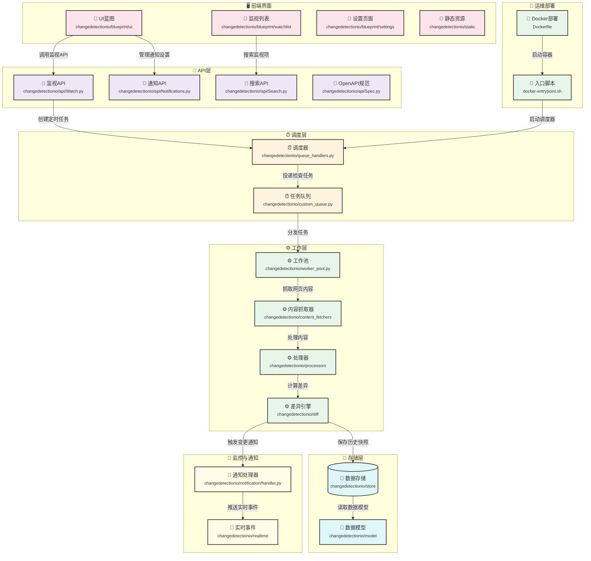

# Block Diagram — 分层模块

本图展示 changedetection.io 的核心分层架构，从用户界面到数据存储、监控通知与运维部署，箭头表示真实运行时数据流方向。

## 子图1：分层全景

```mermaid
flowchart TB
    subgraph L_frontend["🖥️ 前端界面"]
        direction LR
        ui_blueprint["🛒 UI蓝图<br/><small>changedetectionio/blueprint/ui</small>"]
        watchlist_blueprint["🛒 监视列表<br/><small>changedetectionio/blueprint/watchlist</small>"]
        settings_blueprint["🛒 设置页面<br/><small>changedetectionio/blueprint/settings</small>"]
        static_assets["🛒 静态资源<br/><small>changedetectionio/static</small>"]
    end

    subgraph L_api["🔌 API层"]
        direction LR
        api_watch["🔌 监视API<br/><small>changedetectionio/api/Watch.py</small>"]
        api_notifications["🔌 通知API<br/><small>changedetectionio/api/Notifications.py</small>"]
        api_search["🔌 搜索API<br/><small>changedetectionio/api/Search.py</small>"]
        api_spec["🔌 OpenAPI规范<br/><small>changedetectionio/api/Spec.py</small>"]
    end

    subgraph L_schedule["⏰ 调度层"]
        direction LR
        scheduler["⏰ 调度器<br/><small>changedetectionio/queue_handlers.py</small>"]
        queue["⏰ 任务队列<br/><small>changedetectionio/custom_queue.py</small>"]
    end

    subgraph L_worker["⚙️ 工作层"]
        direction LR
        worker_pool["⚙️ 工作池<br/><small>changedetectionio/worker_pool.py</small>"]
        content_fetchers["⚙️ 内容抓取器<br/><small>changedetectionio/content_fetchers</small>"]
        processors["⚙️ 处理器<br/><small>changedetectionio/processors</small>"]
        diff_engine["⚙️ 差异引擎<br/><small>changedetectionio/diff</small>"]
    end

    subgraph L_storage["💾 存储层"]
        direction LR
        datastore[("💾 数据存储<br/><small>changedetectionio/store</small>")]
        model["💾 数据模型<br/><small>changedetectionio/model</small>"]
    end

    subgraph L_monitor["📢 监控与通知"]
        direction LR
        notification_handler["📢 通知处理器<br/><small>changedetectionio/notification/handler.py</small>"]
        realtime["📢 实时事件<br/><small>changedetectionio/realtime</small>"]
    end

    subgraph L_ops["🚀 运维部署"]
        direction LR
        docker["🚀 Docker部署<br/><small>Dockerfile</small>"]
        entrypoint["🚀 入口脚本<br/><small>docker-entrypoint.sh</small>"]
    end

    ui_blueprint -->|调用监视API| api_watch
    ui_blueprint -->|管理通知设置| api_notifications
    watchlist_blueprint -->|搜索监视项| api_search
    api_watch -->|创建定时任务| scheduler
    scheduler -->|投递检查任务| queue
    queue -->|分发任务| worker_pool
    worker_pool -->|抓取网页内容| content_fetchers
    content_fetchers -->|处理内容| processors
    processors -->|计算差异| diff_engine
    diff_engine -->|保存历史快照| datastore
    datastore -->|读取数据模型| model
    diff_engine -->|触发变更通知| notification_handler
    notification_handler -->|推送实时事件| realtime
    docker -->|启动容器| entrypoint
    entrypoint -->|启动调度器| scheduler

    classDef frontend fill:#fce4ec,stroke:#333,stroke-width:2px;
    classDef api fill:#ede7f6,stroke:#333,stroke-width:2px;
    classDef schedule fill:#fff3e0,stroke:#333,stroke-width:2px;
    classDef worker fill:#e8f5e9,stroke:#333,stroke-width:2px;
    classDef storage fill:#e0f7fa,stroke:#333,stroke-width:2px;
    classDef monitor fill:#fffde7,stroke:#333,stroke-width:2px;
    classDef ops fill:#e8f5e9,stroke:#333,stroke-width:2px;

    class ui_blueprint,watchlist_blueprint,settings_blueprint,static_assets frontend;
    class api_watch,api_notifications,api_search,api_spec api;
    class scheduler,queue schedule;
    class worker_pool,content_fetchers,processors,diff_engine worker;
    class datastore,model storage;
    class notification_handler,realtime monitor;
    class docker,entrypoint ops;
```

---
*由 Architecture Viewer 编排流水线生成 · 已过事实核查*