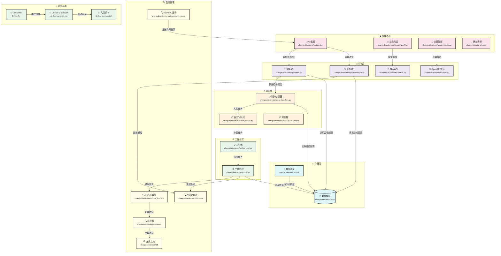

# Block Diagram — 分层模块

本图展示 changedetection.io 的核心分层架构，从用户界面到数据存储与运维部署，箭头表示真实运行时数据流方向。

## 子图1：分层全景

```mermaid
flowchart TB
    subgraph L_frontend["🖥️ 前端界面"]
        direction LR
        ui_blueprint["🛒 UI蓝图<br/><small>changedetectionio/blueprint/ui</small>"]
        watchlist_blueprint["🛒 监视列表<br/><small>changedetectionio/blueprint/watchlist</small>"]
        settings_blueprint["🛒 设置界面<br/><small>changedetectionio/blueprint/settings</small>"]
        static_assets["🛒 静态资源<br/><small>changedetectionio/static</small>"]
    end

    subgraph L_api["🔌 API层"]
        direction LR
        api_watch["🔌 监视API<br/><small>changedetectionio/api/Watch.py</small>"]
        api_notifications["🔌 通知API<br/><small>changedetectionio/api/Notifications.py</small>"]
        api_search["🔌 搜索API<br/><small>changedetectionio/api/Search.py</small>"]
        api_spec["🔌 OpenAPI规范<br/><small>changedetectionio/api/Spec.py</small>"]
    end

    subgraph L_schedule["⏰ 调度层"]
        direction LR
        queue_handlers["⏰ 队列处理器<br/><small>changedetectionio/queue_handlers.py</small>"]
        custom_queue["⏰ 自定义队列<br/><small>changedetectionio/custom_queue.py</small>"]
        scheduler["⏰ 调度器<br/><small>changedetectionio/static/js/scheduler.js</small>"]
    end

    subgraph L_worker["⚙️ 工作线程"]
        direction LR
        worker_pool["⚙️ 工作池<br/><small>changedetectionio/worker_pool.py</small>"]
        worker["⚙️ 工作线程<br/><small>changedetectionio/worker.py</small>"]
    end

    subgraph L_storage["💾 存储层"]
        direction LR
        datastore[("💾 数据存储<br/><small>changedetectionio/store</small>")]
        model["💾 数据模型<br/><small>changedetectionio/model</small>"]
    end

    subgraph L_monitor["🔍 监控处理"]
        direction LR
        content_fetchers["🔍 内容抓取器<br/><small>changedetectionio/content_fetchers</small>"]
        processors["🔍 处理器<br/><small>changedetectionio/processors</small>"]
        diff["🔍 差异比较<br/><small>changedetectionio/diff</small>"]
        notification_handler["🔍 通知处理器<br/><small>changedetectionio/notification</small>"]
        socket_server["🔍 SocketIO服务<br/><small>changedetectionio/realtime/socket_server</small>"]
    end

    subgraph L_ops["🚀 运维部署"]
        direction LR
        dockerfile["🚀 Dockerfile<br/><small>Dockerfile</small>"]
        docker_compose["🚀 Docker Compose<br/><small>docker-compose.yml</small>"]
        entrypoint["🚀 入口脚本<br/><small>docker-entrypoint.sh</small>"]
    end

    ui_blueprint -->|调用监视API| api_watch
    ui_blueprint -->|管理通知| api_notifications
    watchlist_blueprint -->|搜索监视| api_search
    settings_blueprint -->|获取规范| api_spec
    api_watch -->|投递检查任务| queue_handlers
    api_notifications -->|配置通知| notification_handler
    api_notifications -->|读写通知配置| datastore
    api_watch -->|读写监视配置| datastore
    queue_handlers -->|入队任务| custom_queue
    queue_handlers -->|读取任务配置| datastore
    custom_queue -->|分配任务| worker_pool
    worker_pool -->|执行任务| worker
    worker -->|抓取网页| content_fetchers
    content_fetchers -->|处理内容| processors
    processors -->|比较差异| diff
    worker -->|发送通知| notification_handler
    worker -->|读写数据| datastore
    model -->|持久化模型| datastore
    socket_server -->|推送实时更新| ui_blueprint
    dockerfile -->|构建镜像| docker_compose
    docker_compose -->|启动服务| entrypoint

    classDef frontend fill:#fce4ec,stroke:#333,stroke-width:2px;
    classDef api fill:#ede7f6,stroke:#333,stroke-width:2px;
    classDef schedule fill:#fff3e0,stroke:#333,stroke-width:2px;
    classDef worker fill:#e8f5e9,stroke:#333,stroke-width:2px;
    classDef storage fill:#e0f7fa,stroke:#333,stroke-width:2px;
    classDef monitor fill:#fffde7,stroke:#333,stroke-width:2px;
    classDef ops fill:#e8f5e9,stroke:#333,stroke-width:2px;

    class ui_blueprint,watchlist_blueprint,settings_blueprint,static_assets frontend;
    class api_watch,api_notifications,api_search,api_spec api;
    class queue_handlers,custom_queue,scheduler schedule;
    class worker_pool,worker worker;
    class datastore,model storage;
    class content_fetchers,processors,diff,notification_handler,socket_server monitor;
    class dockerfile,docker_compose,entrypoint ops;
```

---
*由 Architecture Viewer 编排流水线生成 · 已过事实核查*
