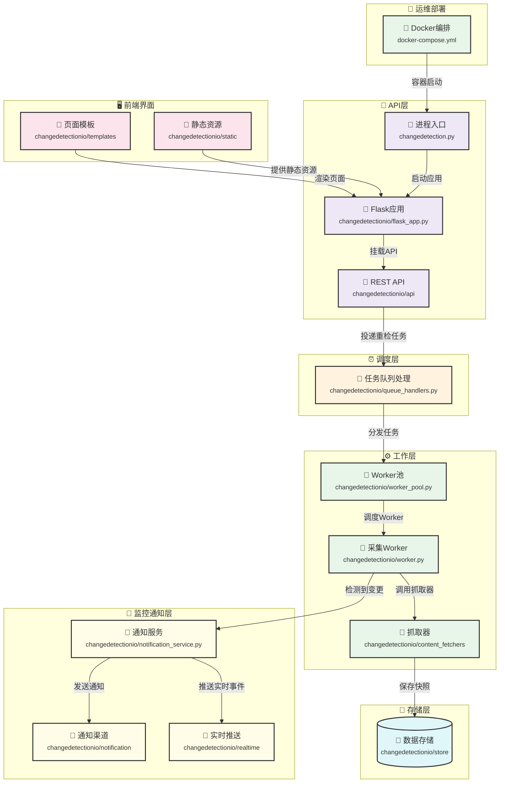

# Block Diagram — 分层模块

> 本图展示 changedetection.io 的核心分层架构与运行时数据流。用户通过 `changedetection.py` 启动 Flask 应用，创建监控任务后由队列调度 worker 抓取网页内容，检测到变化后经 `notification_service` 调用通知渠道发送告警。

## 子图1：分层全景

---
*由 Architecture Viewer 编排流水线生成 · 已过事实核查*
