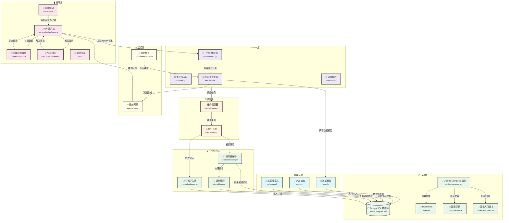

# Block Diagram — 分层模块

本图展示 listmonk 系统的分层架构与运行时数据流。用户通过前端页面发起请求，经 API 入口进入后端处理，最终通过通知服务发送通知。

## 子图1：分层全景

```mermaid
flowchart TB
    subgraph L_frontend["🖥️ 前端层"]
        direction LR
        frontend_src["🛒 前端源码<br/><small>frontend/src</small>"]
        frontend_api["🛒 API 客户端<br/><small>frontend/src/api/index.js</small>"]
        frontend_store["🛒 前端状态存储<br/><small>frontend/src/store</small>"]
        public_templates["🛒 公共模板<br/><small>static/public/templates</small>"]
        static_assets["🛒 静态资源<br/><small>static</small>"]
    end

    subgraph L_api["🔌 API 层"]
        direction LR
        cmd_main["🛒 主程序入口<br/><small>cmd/main.go</small>"]
        cmd_handlers["🛒 HTTP 处理器<br/><small>cmd/handlers.go</small>"]
        internal_core["🛒 核心业务逻辑<br/><small>internal/core</small>"]
        internal_auth["🛒 认证授权<br/><small>internal/auth</small>"]
    end

    subgraph L_schedule["⏰ 调度层"]
        direction LR
        internal_manager["🛒 任务管理器<br/><small>internal/manager</small>"]
        internal_events["🛒 事件系统<br/><small>internal/events</small>"]
    end

    subgraph L_worker["⚙️ 工作线程层"]
        direction LR
        internal_bounce["🛒 退信处理<br/><small>internal/bounce</small>"]
        internal_messenger["🛒 消息发送器<br/><small>internal/messenger</small>"]
        internal_subimporter["🛒 订阅导入器<br/><small>internal/subimporter</small>"]
    end

    subgraph L_storage["🗄️ 存储层"]
        direction LR
        models["🛒 数据模型<br/><small>models</small>"]
        queries["🛒 SQL 查询<br/><small>queries</small>"]
        schema_sql["🛒 数据库模式<br/><small>schema.sql</small>"]
    end

    subgraph L_monitor["📊 监控层"]
        direction LR
        internal_notifs["🛒 通知系统<br/><small>internal/notifs</small>"]
        cmd_maintenance["🛒 维护任务<br/><small>cmd/maintenance.go</small>"]
    end

    subgraph L_ops["🚀 运维层"]
        direction LR
        postgres_db[("💾 PostgreSQL 数据库<br/><small>docker-compose.yml</small>")]
        docker_compose["🛒 Docker Compose 编排<br/><small>docker-compose.yml</small>"]
        dockerfile["🛒 Dockerfile<br/><small>Dockerfile</small>"]
        config_sample["🛒 配置示例<br/><small>config.toml.sample</small>"]
        entrypoint["🛒 容器入口脚本<br/><small>docker-entrypoint.sh</small>"]
    end

    frontend_src -->|调用 API 客户端| frontend_api
    frontend_api -->|发送 HTTP 请求| cmd_handlers
    cmd_handlers -->|调用核心业务| internal_core
    internal_core -->|投递任务| internal_manager
    internal_manager -->|触发事件| internal_events
    internal_events -->|发送消息| internal_messenger
    internal_events -->|触发导入| internal_subimporter
    internal_messenger -->|处理退信| internal_bounce
    internal_core -->|读写数据模型| models
    models -->|持久化数据| postgres_db
    queries -->|执行 SQL| postgres_db
    schema_sql -->|初始化表结构| postgres_db
    internal_core -->|发送通知| internal_notifs
    internal_notifs -->|推送状态| frontend_api
    cmd_maintenance -->|执行维护| internal_core
    docker_compose -->|构建镜像| dockerfile
    docker_compose -->|加载配置| config_sample
    docker_compose -->|启动容器| entrypoint
    frontend_api -->|发起请求| public_templates
    frontend_api -->|存储数据| frontend_store
    public_templates -->|触发请求| frontend_api
    frontend_store -->|提交数据| frontend_api
    internal_messenger -->|记录发送状态| postgres_db
    internal_bounce -->|更新退信状态| postgres_db
    internal_subimporter -->|写入订阅| postgres_db

    classDef frontendClass fill:#fce4ec,stroke:#333,stroke-width:2px;
    classDef apiClass fill:#ede7f6,stroke:#333,stroke-width:2px;
    classDef scheduleClass fill:#fff3e0,stroke:#333,stroke-width:2px;
    classDef workerClass fill:#e8f5e9,stroke:#333,stroke-width:2px;
    classDef storageClass fill:#e0f7fa,stroke:#333,stroke-width:2px;
    classDef monitorClass fill:#fffde7,stroke:#333,stroke-width:2px;
    classDef opsClass fill:#e8f5e9,stroke:#333,stroke-width:2px;

    class frontend_src,frontend_api,frontend_store,public_templates,static_assets frontendClass;
    class cmd_main,cmd_handlers,internal_core,internal_auth apiClass;
    class internal_manager,internal_events scheduleClass;
    class internal_bounce,internal_messenger,internal_subimporter workerClass;
    class models,queries,schema_sql storageClass;
    class internal_notifs,cmd_maintenance monitorClass;
    class postgres_db,docker_compose,dockerfile,config_sample,entrypoint opsClass;
```

---

*由 Architecture Viewer 编排流水线生成 · 已过事实核查*
