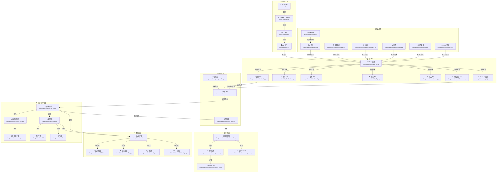

# Block Diagram — 分层模块

本图展示 changedetection.io 的核心分层架构，从用户交互界面到数据存储与监控通知的完整数据流。

## 子图1：分层全景

```mermaid
flowchart TB
    subgraph L_frontend["🖥️ 前端/交互"]
        direction LR
        ui_blueprint["🖥️ UI 蓝图<br/><small>changedetectionio/blueprint/ui</small>"]
        watchlist_blueprint["📋 监控列表<br/><small>changedetectionio/blueprint/watchlist</small>"]
        add_watch_ui["➕ 添加监控<br/><small>changedetectionio/blueprint/add_watch_ui</small>"]
        settings_blueprint["⚙️ 设置<br/><small>changedetectionio/blueprint/settings</small>"]
        tags_blueprint["🏷️ 标签管理<br/><small>changedetectionio/blueprint/tags</small>"]
        rss_blueprint["📡 RSS 订阅<br/><small>changedetectionio/blueprint/rss</small>"]
        static_js["📜 前端脚本<br/><small>changedetectionio/static/js</small>"]
    end

    subgraph L_api["🔌 后端/API"]
        direction LR
        api_watch["👁️ 监控 API<br/><small>changedetectionio/api/Watch.py</small>"]
        api_notifications["🔔 通知 API<br/><small>changedetectionio/api/Notifications.py</small>"]
        api_search["🔍 搜索 API<br/><small>changedetectionio/api/Search.py</small>"]
        api_tags["🏷️ 标签 API<br/><small>changedetectionio/api/Tags.py</small>"]
        api_import["📥 导入 API<br/><small>changedetectionio/api/Import.py</small>"]
        api_system_info["📊 系统信息 API<br/><small>changedetectionio/api/SystemInfo.py</small>"]
        api_spec["📜 OpenAPI 规范<br/><small>changedetectionio/api/Spec.py</small>"]
        flask_app["🚀 Flask 应用<br/><small>changedetectionio/flask_app.py</small>"]
    end

    subgraph L_schedule["⏰ 调度/队列"]
        direction LR
        scheduler["📅 调度器<br/><small>changedetectionio/queue_handlers.py</small>"]
        update_queue["🔄 更新队列<br/><small>changedetectionio/custom_queue.py</small>"]
        notification_queue["📨 通知队列<br/><small>changedetectionio/custom_queue.py</small>"]
    end

    subgraph L_worker["⚙️ 采集/异步处理"]
        direction LR
        worker_pool["👷 工作线程池<br/><small>changedetectionio/worker_pool.py</small>"]
        content_fetchers["🌐 内容抓取器<br/><small>changedetectionio/content_fetchers</small>"]
        processors["🔧 处理器<br/><small>changedetectionio/processors</small>"]
        diff_engine["📝 差异引擎<br/><small>changedetectionio/diff</small>"]
        llm_evaluator["🤖 LLM 评估器<br/><small>changedetectionio/llm</small>"]
        browser_steps["🖱️ 浏览器步骤<br/><small>changedetectionio/browser_steps</small>"]
    end

    subgraph L_storage["💾 数据存储"]
        direction LR
        datastore["💾 数据存储<br/><small>changedetectionio/store</small>"]
        watch_model["📄 监控模型<br/><small>changedetectionio/model/Watch.py</small>"]
        tag_model["🏷️ 标签模型<br/><small>changedetectionio/model/Tag.py</small>"]
        app_model["⚙️ 应用模型<br/><small>changedetectionio/model/App.py</small>"]
        llm_settings["🤖 LLM 设置<br/><small>changedetectionio/model/LLMSettings.py</small>"]
    end

    subgraph L_monitor["📢 监控/通知"]
        direction LR
        notification_handler["📨 通知处理器<br/><small>changedetectionio/notification/handler.py</small>"]
        notification_service["🔔 通知服务<br/><small>changedetectionio/notification_service.py</small>"]
        apprise_plugin["📣 Apprise 插件<br/><small>changedetectionio/notification/apprise_plugin</small>"]
        realtime_socket["🔌 实时 Socket<br/><small>changedetectionio/realtime/socket_server.py</small>"]
    end

    subgraph L_ops["🚀 交付/运维"]
        direction LR
        dockerfile["🐳 Dockerfile<br/><small>Dockerfile</small>"]
        docker_compose["📦 Docker Compose<br/><small>docker-compose.yml</small>"]
        entrypoint["🚀 入口脚本<br/><small>docker-entrypoint.sh</small>"]
        cli_entry["🖥️ CLI 入口<br/><small>changedetection.py</small>"]
    end

    ui_blueprint -->|"HTTP 请求"| flask_app
    watchlist_blueprint -->|"HTTP 请求"| flask_app
    add_watch_ui -->|"HTTP 请求"| flask_app
    settings_blueprint -->|"HTTP 请求"| flask_app
    tags_blueprint -->|"HTTP 请求"| flask_app
    rss_blueprint -->|"HTTP 请求"| flask_app
    static_js -->|"浏览器加载"| ui_blueprint

    flask_app -->|"路由分发"| api_watch
    flask_app -->|"路由分发"| api_notifications
    flask_app -->|"路由分发"| api_search
    flask_app -->|"路由分发"| api_tags
    flask_app -->|"路由分发"| api_import
    flask_app -->|"路由分发"| api_system_info
    flask_app -->|"路由分发"| api_spec

    api_watch -->|"投递任务"| update_queue
    api_system_info -->|"读取队列状态"| update_queue
    scheduler -->|"触发检查"| update_queue
    update_queue -->|"投递任务"| worker_pool
    worker_pool -->|"调用"| content_fetchers
    worker_pool -->|"调用"| processors
    processors -->|"使用"| diff_engine
    processors -->|"调用"| llm_evaluator
    content_fetchers -->|"执行"| browser_steps

    worker_pool -->|"读写"| datastore
    processors -->|"读写"| datastore
    datastore -->|"持久化"| watch_model
    datastore -->|"持久化"| tag_model
    datastore -->|"持久化"| app_model
    datastore -->|"持久化"| llm_settings

    worker_pool -->|"投递通知"| notification_queue
    notification_queue -->|"消费"| notification_handler
    notification_handler -->|"调用"| notification_service
    notification_service -->|"使用"| apprise_plugin
    notification_handler -->|"触发"| realtime_socket

    dockerfile -->|"构建"| docker_compose
    docker_compose -->|"运行"| entrypoint
    entrypoint -->|"启动"| cli_entry
    cli_entry -->|"初始化"| flask_app
```

---
*由 Architecture Viewer 编排流水线生成 · 已过事实核查*