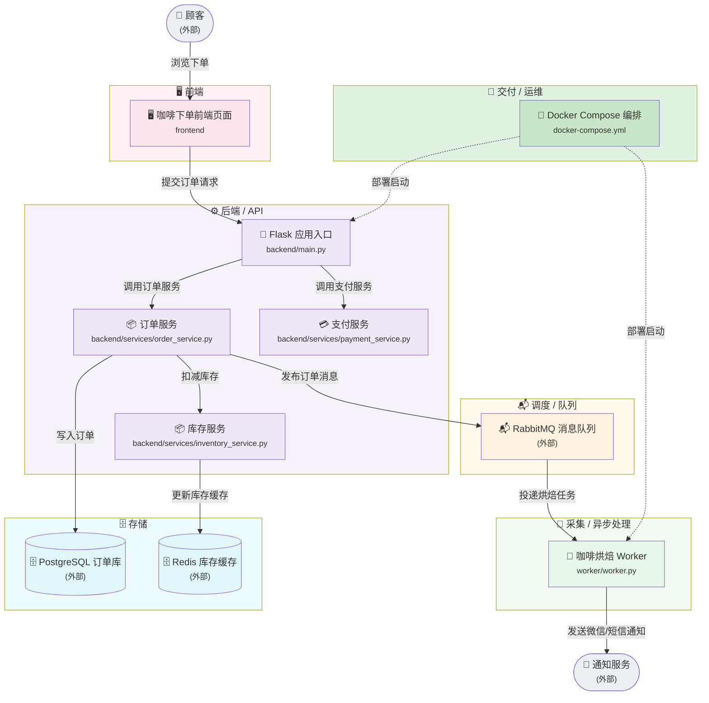
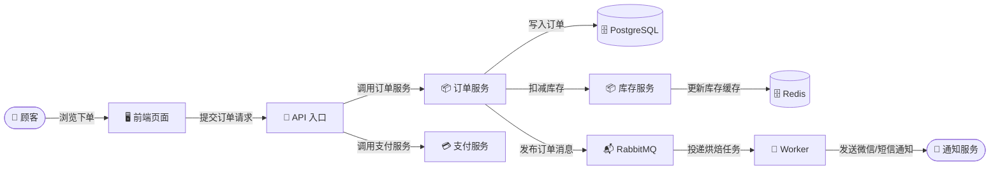

# Block Diagram — 咖啡订单平台

> 顾客在 Web 下单，API 落库扣库存，消息队列驱动 Worker 烘焙并发送微信/短信通知。

## 子图1：分层全景

```mermaid
flowchart TB
    subgraph L_frontend["🖥️ 前端"]
        direction LR
        frontend_web["🖥️ 咖啡下单前端页面<br/><small>frontend</small>"]
    end

    subgraph L_api["⚙️ 后端 / API"]
        direction LR
        api_entry["🧩 Flask 应用入口<br/><small>backend/main.py</small>"]
        order_service["📦 订单服务<br/><small>backend/services/order_service.py</small>"]
        inventory_service["📦 库存服务<br/><small>backend/services/inventory_service.py</small>"]
        payment_service["💳 支付服务<br/><small>backend/services/payment_service.py</small>"]
    end

    subgraph L_schedule["📬 调度 / 队列"]
        direction LR
        rabbitmq["📬 RabbitMQ 消息队列<br/><small>(外部)</small>"]
    end

    subgraph L_worker["👷 采集 / 异步处理"]
        direction LR
        brew_worker["👷 咖啡烘焙 Worker<br/><small>worker/worker.py</small>"]
    end

    subgraph L_storage["🗄️ 存储"]
        direction LR
        postgres_db[("🗄️ PostgreSQL 订单库<br/><small>(外部)</small>")]
        redis_cache[("🗄️ Redis 库存缓存<br/><small>(外部)</small>")]
    end

    subgraph L_ops["🚀 交付 / 运维"]
        direction LR
        compose["🐳 Docker Compose 编排<br/><small>docker-compose.yml</small>"]
    end

    actor_user(["👤 顾客<br/><small>(外部)</small>"])
    actor_external_system(["🔔 通知服务<br/><small>(外部)</small>"])

    classDef actor fill:#eceff1
    class actor_user,actor_external_system actor

    classDef frontend fill:#fce4ec
    class frontend_web frontend

    classDef api fill:#ede7f6
    class api_entry,order_service,inventory_service,payment_service api

    classDef schedule fill:#fff3e0
    class rabbitmq schedule

    classDef worker fill:#e8f5e9
    class brew_worker worker

    classDef storage fill:#e0f7fa
    class postgres_db,redis_cache storage

    classDef ops fill:#c8e6c9
    class compose ops

    style L_frontend fill:#fce4ec88
    style L_api fill:#ede7f688
    style L_schedule fill:#fff3e088
    style L_worker fill:#e8f5e988
    style L_storage fill:#e0f7fa88
    style L_ops fill:#c8e6c988

    actor_user -->|浏览下单| frontend_web
    frontend_web -->|提交订单请求| api_entry
    api_entry -->|调用订单服务| order_service
    api_entry -->|调用支付服务| payment_service
    order_service -->|写入订单| postgres_db
    order_service -->|扣减库存| inventory_service
    inventory_service -->|更新库存缓存| redis_cache
    order_service -->|发布订单消息| rabbitmq
    rabbitmq -->|投递烘焙任务| brew_worker
    brew_worker -->|发送微信/短信通知| actor_external_system
    compose -.->|部署启动| api_entry
    compose -.->|部署启动| brew_worker
```

## 子图2：下单主链路

```mermaid
flowchart LR
    A(["👤 顾客"])
    B["🖥️ 前端页面"]
    C["🧩 API 入口"]
    D["📦 订单服务"]
    E["💳 支付服务"]
    F[("🗄️ PostgreSQL")]
    G["📦 库存服务"]
    H[("🗄️ Redis")]
    I["📬 RabbitMQ"]
    J["👷 Worker"]
    K(["🔔 通知服务"])

    A -->|浏览下单| B
    B -->|提交订单请求| C
    C -->|调用订单服务| D
    C -->|调用支付服务| E
    D -->|写入订单| F
    D -->|扣减库存| G
    G -->|更新库存缓存| H
    D -->|发布订单消息| I
    I -->|投递烘焙任务| J
    J -->|发送微信/短信通知| K
```

---

*由 Architecture Viewer 编排流水线生成 · 已过事实核查*
"
}
