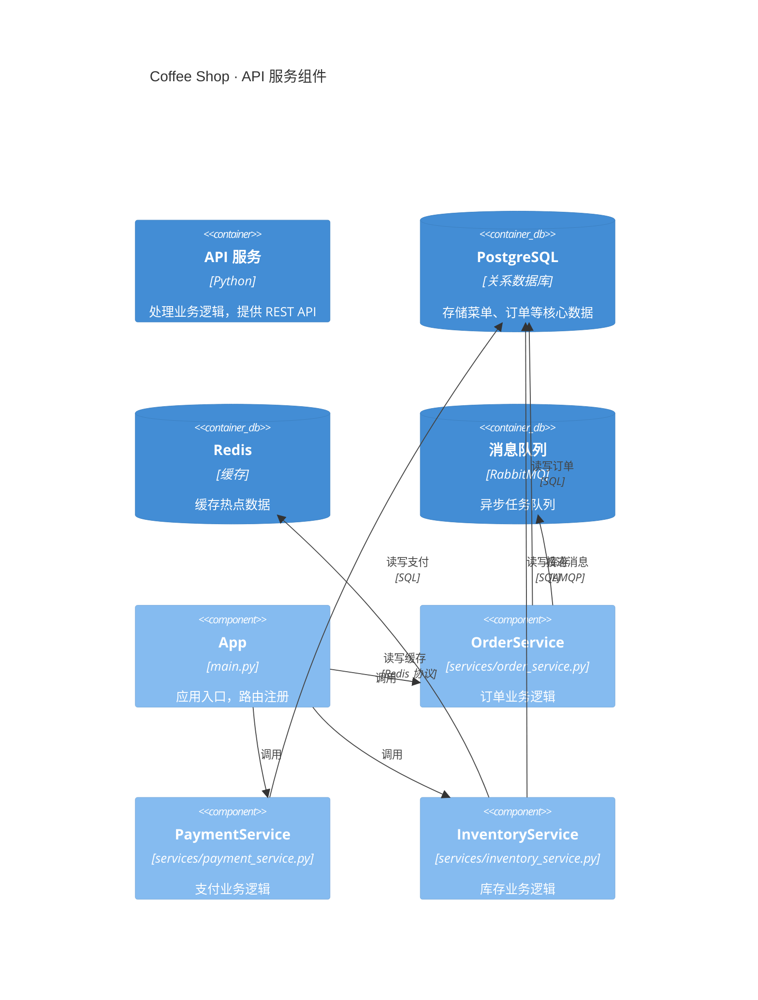
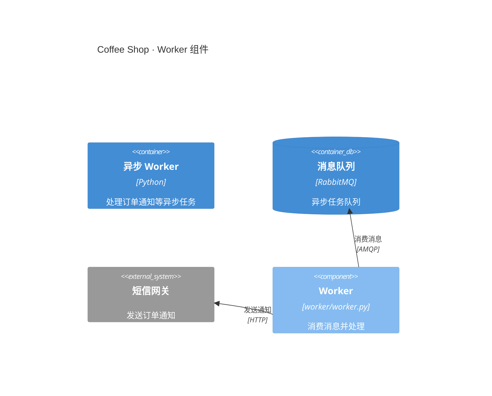

## 子图1：API 服务组件

```mermaid
C4Component
    title Coffee Shop · API 服务组件
    Container(api, "API 服务", "Python", "处理业务逻辑，提供 REST API")
    ContainerDb(postgres, "PostgreSQL", "关系数据库", "存储菜单、订单等核心数据")
    ContainerDb(redis, "Redis", "缓存", "缓存热点数据")
    ContainerDb(mq, "消息队列", "RabbitMQ", "异步任务队列")

    Component(main, "App", "main.py", "应用入口，路由注册")
    Component(order_svc, "OrderService", "services/order_service.py", "订单业务逻辑")
    Component(payment_svc, "PaymentService", "services/payment_service.py", "支付业务逻辑")
    Component(inventory_svc, "InventoryService", "services/inventory_service.py", "库存业务逻辑")

    Rel(main, order_svc, "调用")
    Rel(main, payment_svc, "调用")
    Rel(main, inventory_svc, "调用")
    Rel(order_svc, postgres, "读写订单", "SQL")
    Rel(order_svc, mq, "投递消息", "AMQP")
    Rel(payment_svc, postgres, "读写支付", "SQL")
    Rel(inventory_svc, postgres, "读写库存", "SQL")
    Rel(inventory_svc, redis, "读写缓存", "Redis 协议")

    UpdateLayoutConfig($c4ShapeInRow="3", $c4BoundaryInRow="1")
```

## 子图2：Worker 组件

```mermaid
C4Component
    title Coffee Shop · Worker 组件
    Container(worker, "异步 Worker", "Python", "处理订单通知等异步任务")
    ContainerDb(mq, "消息队列", "RabbitMQ", "异步任务队列")
    System_Ext(sms_gateway, "短信网关", "发送订单通知")

    Component(worker_main, "Worker", "worker/worker.py", "消费消息并处理")

    Rel(worker_main, mq, "消费消息", "AMQP")
    Rel(worker_main, sms_gateway, "发送通知", "HTTP")

    UpdateLayoutConfig($c4ShapeInRow="3", $c4BoundaryInRow="1")
```
