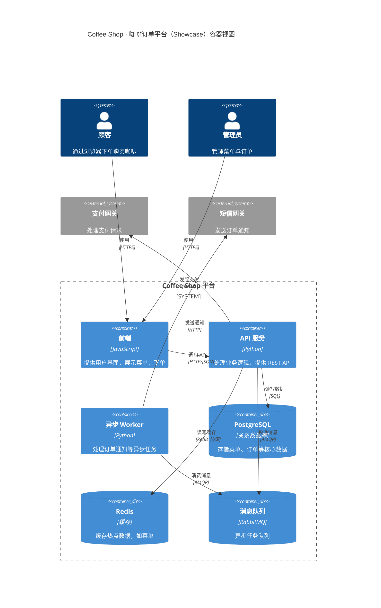

## 子图1：容器视图

```mermaid
C4Container
    title Coffee Shop · 咖啡订单平台（Showcase）容器视图
    Person(customer, "顾客", "通过浏览器下单购买咖啡")
    Person(admin, "管理员", "管理菜单与订单")

    System_Boundary(coffee_shop, "Coffee Shop 平台") {
        Container(frontend, "前端", "JavaScript", "提供用户界面，展示菜单、下单")
        Container(api, "API 服务", "Python", "处理业务逻辑，提供 REST API")
        Container(worker, "异步 Worker", "Python", "处理订单通知等异步任务")
        ContainerDb(postgres, "PostgreSQL", "关系数据库", "存储菜单、订单等核心数据")
        ContainerDb(redis, "Redis", "缓存", "缓存热点数据，如菜单")
        ContainerDb(mq, "消息队列", "RabbitMQ", "异步任务队列")
    }

    System_Ext(payment_gateway, "支付网关", "处理支付请求")
    System_Ext(sms_gateway, "短信网关", "发送订单通知")

    Rel(customer, frontend, "使用", "HTTPS")
    Rel(admin, frontend, "使用", "HTTPS")
    Rel(frontend, api, "调用 API", "HTTP/JSON")
    Rel(api, postgres, "读写数据", "SQL")
    Rel(api, redis, "读写缓存", "Redis 协议")
    Rel(api, mq, "投递消息", "AMQP")
    Rel(worker, mq, "消费消息", "AMQP")
    Rel(worker, sms_gateway, "发送通知", "HTTP")
    Rel(api, payment_gateway, "发起支付", "HTTP")

    UpdateLayoutConfig($c4ShapeInRow="3", $c4BoundaryInRow="1")
```
