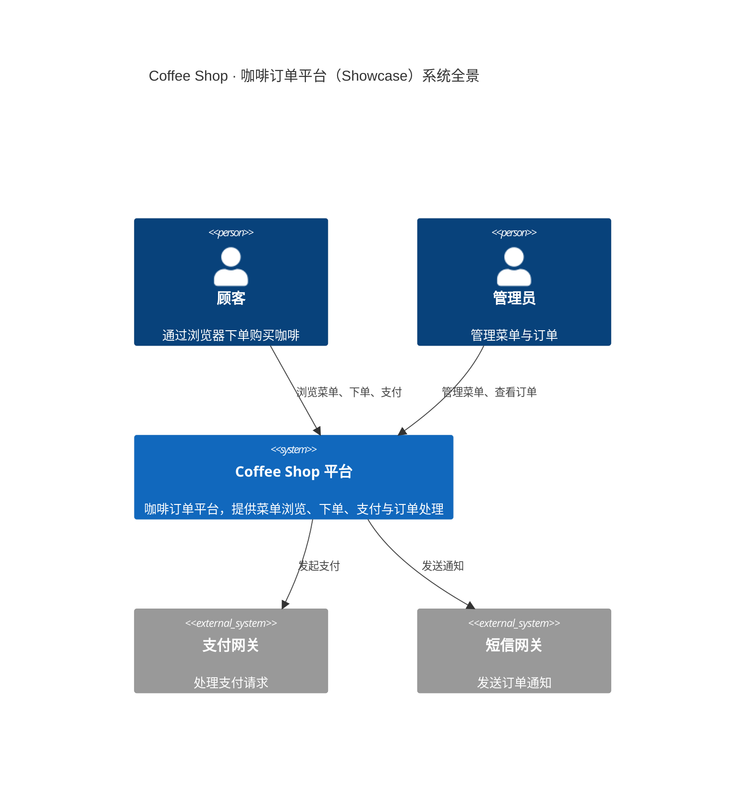

## 子图1：系统全景

```mermaid
C4Context
    title Coffee Shop · 咖啡订单平台（Showcase）系统全景
    Person(customer, "顾客", "通过浏览器下单购买咖啡")
    Person(admin, "管理员", "管理菜单与订单")
    System(coffee_shop, "Coffee Shop 平台", "咖啡订单平台，提供菜单浏览、下单、支付与订单处理")
    System_Ext(payment_gateway, "支付网关", "处理支付请求")
    System_Ext(sms_gateway, "短信网关", "发送订单通知")

    Rel(customer, coffee_shop, "浏览菜单、下单、支付")
    Rel(admin, coffee_shop, "管理菜单、查看订单")
    Rel(coffee_shop, payment_gateway, "发起支付")
    Rel(coffee_shop, sms_gateway, "发送通知")

    UpdateLayoutConfig($c4ShapeInRow="3", $c4BoundaryInRow="1")
```
