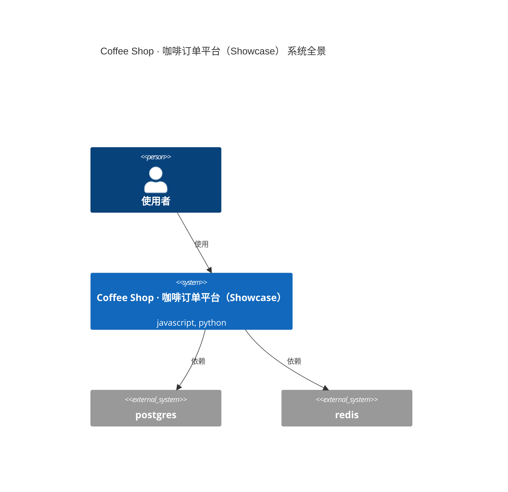
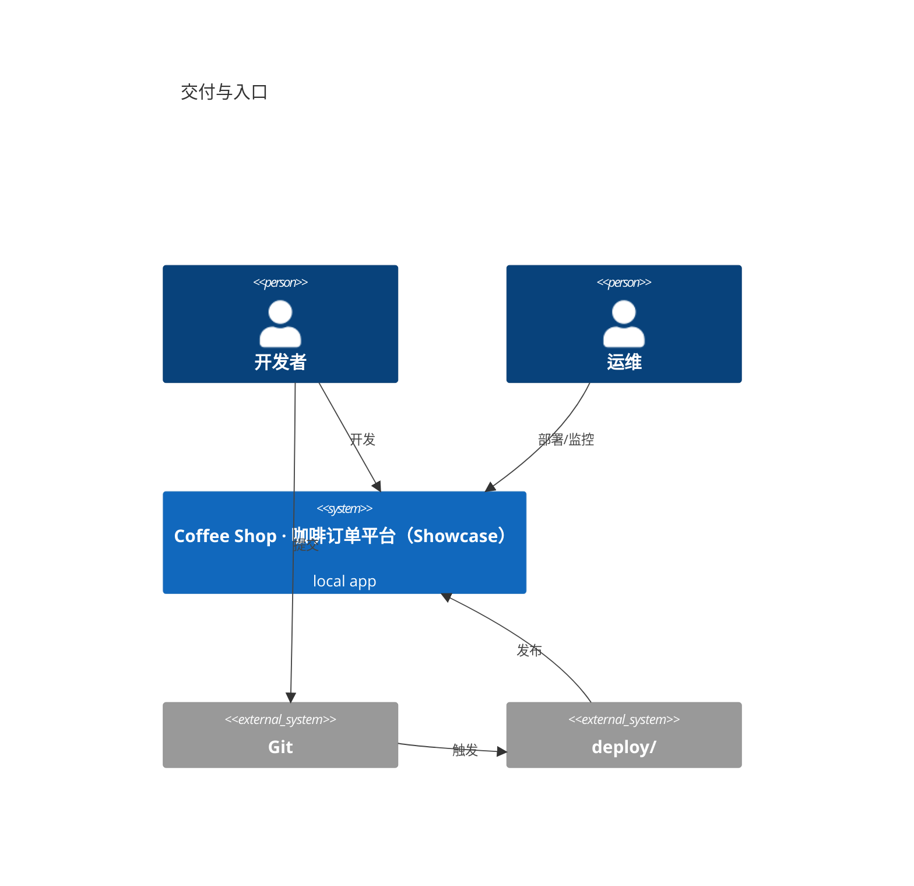

# C4 Context — 系统全景

## 子图1：系统与使用者

```mermaid
C4Context
    title Coffee Shop · 咖啡订单平台（Showcase） 系统全景

    Person(user, "使用者")
    System(sys, "Coffee Shop · 咖啡订单平台（Showcase）", "javascript, python")
    System_Ext(ext_postgres, "postgres")
    System_Ext(ext_redis, "redis")

    Rel(user, sys, "使用")
    Rel(sys, ext_postgres, "依赖")
    Rel(sys, ext_redis, "依赖")

    UpdateLayoutConfig($c4ShapeInRow="3", $c4BoundaryInRow="1")
```

## 子图2：运行时与交付面

```mermaid
C4Context
    title 交付与入口

    Person(dev, "开发者")
    Person(ops, "运维")
    System(sys_deploy, "Coffee Shop · 咖啡订单平台（Showcase）", "local app")
    System_Ext(vcs, "Git")
    System_Ext(ci, "deploy/")

    Rel(dev, sys_deploy, "开发")
    Rel(ops, sys_deploy, "部署/监控")
    Rel(dev, vcs, "提交")
    Rel(vcs, ci, "触发")
    Rel(ci, sys_deploy, "发布")

    UpdateLayoutConfig($c4ShapeInRow="3", $c4BoundaryInRow="1")
```

---

*由 Architecture Viewer Community Generate 根据仓库扫描生成 · 请人工审阅后提交*
