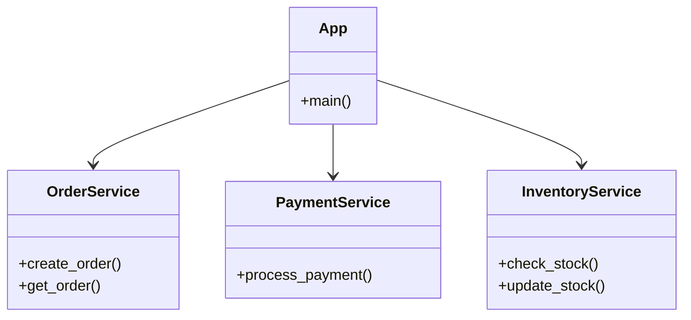

## 子图1：核心领域模型

```mermaid
classDiagram
    class App {
        +main()
    }
    class OrderService {
        +create_order()
        +get_order()
    }
    class PaymentService {
        +process_payment()
    }
    class InventoryService {
        +check_stock()
        +update_stock()
    }

    App --> OrderService
    App --> PaymentService
    App --> InventoryService
```
