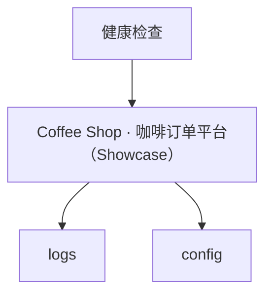

# Deploy & Ops — 部署运维

## 子图1：交付路径

```mermaid
flowchart LR
  build["构建 javascript,python"]
  d0["deploy/"]
  build --> d0
```

## 子图2：运行时探测

```mermaid
flowchart TB
  health["健康检查"] --> app["Coffee Shop · 咖啡订单平台（Showcase）"]
  app --> logs["logs"]
  app --> cfg["config"]
```

---

*由 Architecture Viewer Community Generate 根据仓库扫描生成 · 请人工审阅后提交*
