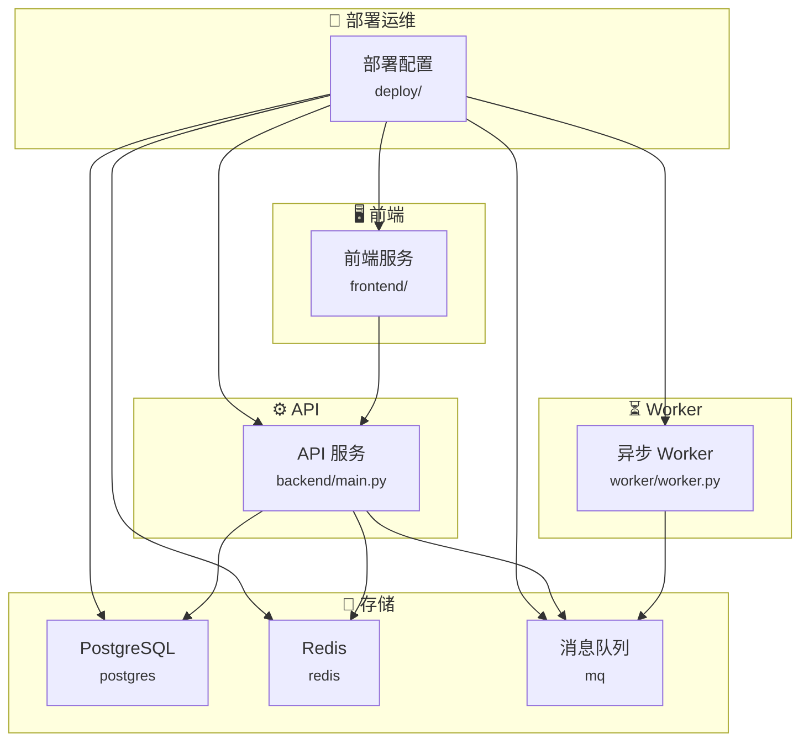

## 子图1：部署拓扑

```mermaid
flowchart TB
    subgraph L_ops["🚀 部署运维"]
        deploy["部署配置<br/><small>deploy/</small>"]
    end

    subgraph L_frontend["🖥️ 前端"]
        frontend["前端服务<br/><small>frontend/</small>"]
    end

    subgraph L_api["⚙️ API"]
        api["API 服务<br/><small>backend/main.py</small>"]
    end

    subgraph L_worker["⏳ Worker"]
        worker["异步 Worker<br/><small>worker/worker.py</small>"]
    end

    subgraph L_storage["💾 存储"]
        postgres["PostgreSQL<br/><small>postgres</small>"]
        redis["Redis<br/><small>redis</small>"]
        mq["消息队列<br/><small>mq</small>"]
    end

    deploy --> frontend
    deploy --> api
    deploy --> worker
    deploy --> postgres
    deploy --> redis
    deploy --> mq

    frontend --> api
    api --> postgres
    api --> redis
    api --> mq
    worker --> mq
```
