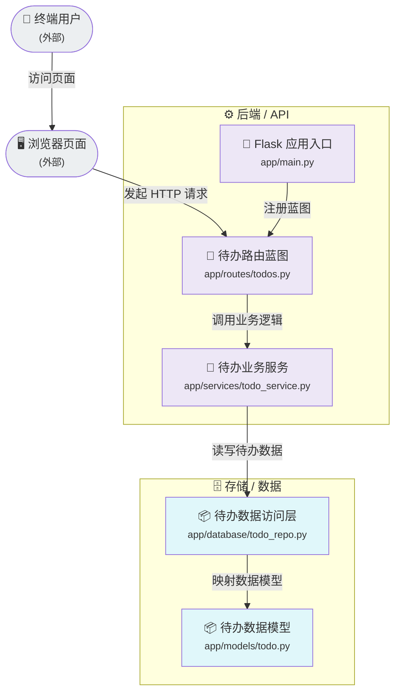

# Block Diagram — 分层模块

一个基于 Flask 的待办清单 Web 应用，提供 REST API 管理待办事项（列表、新建、完成、清理、统计），数据落在本地 SQLite。

## 子图1：分层全景

```mermaid
flowchart TB
    subgraph L_api["⚙️ 后端 / API"]
        direction LR
        flask_app["🧩 Flask 应用入口<br/><small>app/main.py</small>"]
        todos_routes["🔌 待办路由蓝图<br/><small>app/routes/todos.py</small>"]
        todo_service["📐 待办业务服务<br/><small>app/services/todo_service.py</small>"]
    end

    subgraph L_storage["🗄️ 存储 / 数据"]
        direction LR
        todo_repo["📦 待办数据访问层<br/><small>app/database/todo_repo.py</small>"]
        todo_model["📦 待办数据模型<br/><small>app/models/todo.py</small>"]
    end

    actor_user(["👤 终端用户<br/><small>(外部)</small>"])
    web_browser(["🖥️ 浏览器页面<br/><small>(外部)</small>"])

    classDef actor fill:#eceff1
    class actor_user,web_browser actor

    classDef api fill:#ede7f6
    class flask_app,todos_routes,todo_service api

    classDef storage fill:#e0f7fa
    class todo_repo,todo_model storage

    actor_user -->|访问页面| web_browser
    web_browser -->|发起 HTTP 请求| todos_routes
    flask_app -->|注册蓝图| todos_routes
    todos_routes -->|调用业务逻辑| todo_service
    todo_service -->|读写待办数据| todo_repo
    todo_repo -->|映射数据模型| todo_model
```

## 子图2：用户操作主链路

```mermaid
flowchart LR
    A(["👤 终端用户"]) -->|访问页面| B(["🖥️ 浏览器页面"])
    B -->|发起 HTTP 请求| C(["🔌 待办路由蓝图"])
    C -->|调用业务逻辑| D(["📐 待办业务服务"])
    D -->|读写待办数据| E(["📦 待办数据访问层"])
    E -->|映射数据模型| F(["📦 待办数据模型"])
```

---

*由 Architecture Viewer 编排流水线生成 · 已过事实核查*
