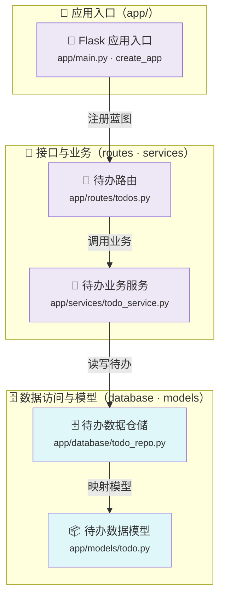

## 组件怎么分工

```mermaid
flowchart TB
    subgraph L_entry["🚪 应用入口（app/）"]
        direction LR
        main_app["🐍 Flask 应用入口<br/><small>app/main.py · create_app</small>"]
    end

    subgraph L_api["🔌 接口与业务（routes · services）"]
        direction LR
        routes_todos["🔌 待办路由<br/><small>app/routes/todos.py</small>"]
        todo_service["📐 待办业务服务<br/><small>app/services/todo_service.py</small>"]
    end

    subgraph L_data["🗄️ 数据访问与模型（database · models）"]
        direction LR
        todo_repo["🗄️ 待办数据仓储<br/><small>app/database/todo_repo.py</small>"]
        todo_model["📦 待办数据模型<br/><small>app/models/todo.py</small>"]
    end

    main_app -->|注册蓝图| routes_todos
    routes_todos -->|调用业务| todo_service
    todo_service -->|读写待办| todo_repo
    todo_repo -->|映射模型| todo_model

    classDef api fill:#ede7f6
    classDef data fill:#e0f7fa
    class main_app,routes_todos,todo_service api
    class todo_repo,todo_model data
```

## 一次请求的代码调用

```mermaid
flowchart LR
    A(["🐍 应用入口"]) -->|注册蓝图| B(["🔌 待办路由"])
    B -->|调用服务| C(["📐 待办服务"])
    C -->|访问仓储| D(["🗄️ 待办仓储"])
    D -->|映射模型| E(["📦 Todo 模型"])
```
