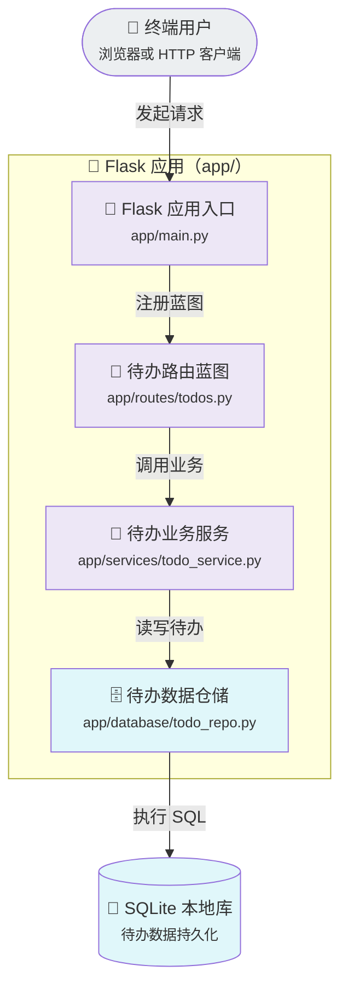
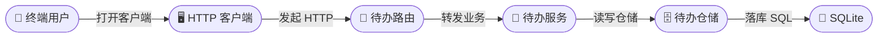

## 进程怎么分层

```mermaid
flowchart TB
    user(["👤 终端用户<br/><small>浏览器或 HTTP 客户端</small>"])

    subgraph APP["🧩 Flask 应用（app/）"]
        direction LR
        entry["🐍 Flask 应用入口<br/><small>app/main.py</small>"]
        routes["🔌 待办路由蓝图<br/><small>app/routes/todos.py</small>"]
        service["📐 待办业务服务<br/><small>app/services/todo_service.py</small>"]
        repo["🗄️ 待办数据仓储<br/><small>app/database/todo_repo.py</small>"]
    end

    db[("💾 SQLite 本地库<br/><small>待办数据持久化</small>")]

    user -->|发起请求| entry
    entry -->|注册蓝图| routes
    routes -->|调用业务| service
    service -->|读写待办| repo
    repo -->|执行 SQL| db

    classDef actor fill:#eceff1
    classDef api fill:#ede7f6
    classDef data fill:#e0f7fa
    class user actor
    class entry,routes,service api
    class repo,db data
```

## 一次 HTTP 请求怎么进出

```mermaid
flowchart LR
    A(["👤 终端用户"]) -->|打开客户端| B(["🖥️ HTTP 客户端"])
    B -->|发起 HTTP| C(["🔌 待办路由"])
    C -->|转发业务| D(["📐 待办服务"])
    D -->|读写仓储| E(["🗄️ 待办仓储"])
    E -->|落库 SQL| F(["💾 SQLite"])
```
