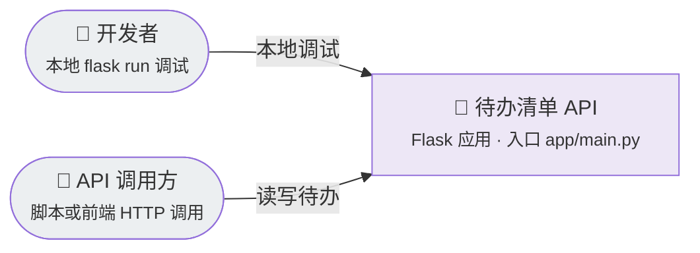
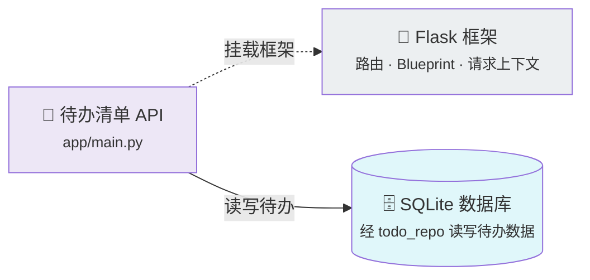

## 谁在用系统

```mermaid
flowchart LR
    dev(["👤 开发者<br/><small>本地 flask run 调试</small>"])
    client(["👤 API 调用方<br/><small>脚本或前端 HTTP 调用</small>"])

    sys["🧩 待办清单 API<br/><small>Flask 应用 · 入口 app/main.py</small>"]

    dev -->|本地调试| sys
    client -->|读写待办| sys

    classDef actor fill:#eceff1
    classDef sys fill:#ede7f6
    class dev,client actor
    class sys sys
```

## 跑起来靠谁

```mermaid
flowchart LR
    sys["🧩 待办清单 API<br/><small>app/main.py</small>"]

    flask["🔌 Flask 框架<br/><small>路由 · Blueprint · 请求上下文</small>"]
    sqlite[("🗄️ SQLite 数据库<br/><small>经 todo_repo 读写待办数据</small>")]

    sys -.->|挂载框架| flask
    sys -->|读写待办| sqlite

    classDef sys fill:#ede7f6
    classDef ext fill:#eceff1
    classDef data fill:#e0f7fa
    class sys sys
    class flask ext
    class sqlite data
```
