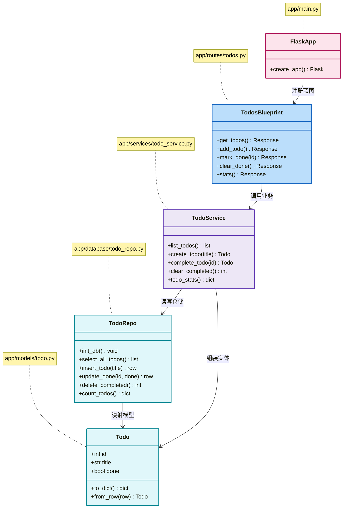
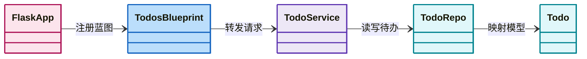

## 领域结构

```mermaid
classDiagram
direction TB

class Todo {
    +int id
    +str title
    +bool done
    +to_dict() dict
    +from_row(row) Todo
}

class TodoRepo {
    +init_db() void
    +select_all_todos() list
    +insert_todo(title) row
    +update_done(id, done) row
    +delete_completed() int
    +count_todos() dict
}

class TodoService {
    +list_todos() list
    +create_todo(title) Todo
    +complete_todo(id) Todo
    +clear_completed() int
    +todo_stats() dict
}

class TodosBlueprint {
    +get_todos() Response
    +add_todo() Response
    +mark_done(id) Response
    +clear_done() Response
    +stats() Response
}

class FlaskApp {
    +create_app() Flask
}

note for Todo "app/models/todo.py"
note for TodoRepo "app/database/todo_repo.py"
note for TodoService "app/services/todo_service.py"
note for TodosBlueprint "app/routes/todos.py"
note for FlaskApp "app/main.py"

TodoRepo --> Todo : 映射模型
TodoService --> TodoRepo : 读写仓储
TodoService --> Todo : 组装实体
TodosBlueprint --> TodoService : 调用业务
FlaskApp --> TodosBlueprint : 注册蓝图

style Todo fill:#e0f7fa,stroke:#00838f,stroke-width:2px
style TodoRepo fill:#e0f7fa,stroke:#00838f,stroke-width:2px
style TodoService fill:#ede7f6,stroke:#5e35b1,stroke-width:2px
style TodosBlueprint fill:#bbdefb,stroke:#1565c0,stroke-width:2px
style FlaskApp fill:#fce4ec,stroke:#ad1457,stroke-width:2px
```

## 调用主链路

```mermaid
classDiagram
direction LR

class FlaskApp
class TodosBlueprint
class TodoService
class TodoRepo
class Todo

FlaskApp --> TodosBlueprint : 注册蓝图
TodosBlueprint --> TodoService : 转发请求
TodoService --> TodoRepo : 读写待办
TodoRepo --> Todo : 映射模型

style Todo fill:#e0f7fa,stroke:#00838f,stroke-width:2px
style TodoRepo fill:#e0f7fa,stroke:#00838f,stroke-width:2px
style TodoService fill:#ede7f6,stroke:#5e35b1,stroke-width:2px
style TodosBlueprint fill:#bbdefb,stroke:#1565c0,stroke-width:2px
style FlaskApp fill:#fce4ec,stroke:#ad1457,stroke-width:2px
```
