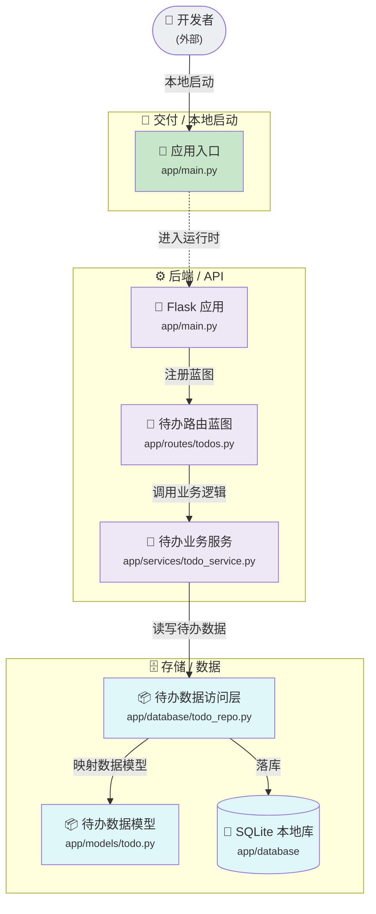

# Deploy & Ops — 部署运维

这个待办 API 没有 compose / k8s，交付面就是本地进程启动，数据落在 SQLite 文件。

## 本地怎么启动

```mermaid
flowchart TB
    subgraph L_ops["🚀 交付 / 本地启动"]
        direction LR
        main_entry["🐍 应用入口<br/><small>app/main.py</small>"]
    end

    subgraph L_api["⚙️ 后端 / API"]
        direction LR
        flask_app["🧩 Flask 应用<br/><small>app/main.py</small>"]
        routes["🔌 待办路由蓝图<br/><small>app/routes/todos.py</small>"]
        service["📐 待办业务服务<br/><small>app/services/todo_service.py</small>"]
    end

    subgraph L_storage["🗄️ 存储 / 数据"]
        direction LR
        repo["📦 待办数据访问层<br/><small>app/database/todo_repo.py</small>"]
        model["📦 待办数据模型<br/><small>app/models/todo.py</small>"]
        dbfile[("💾 SQLite 本地库<br/><small>app/database</small>")]
    end

    dev(["👤 开发者<br/><small>(外部)</small>"])

    classDef ops fill:#c8e6c9
    classDef api fill:#ede7f6
    classDef storage fill:#e0f7fa
    classDef actor fill:#eceff1
    class main_entry ops
    class flask_app,routes,service api
    class repo,model,dbfile storage
    class dev actor

    dev -->|本地启动| main_entry
    main_entry -.->|进入运行时| flask_app
    flask_app -->|注册蓝图| routes
    routes -->|调用业务逻辑| service
    service -->|读写待办数据| repo
    repo -->|映射数据模型| model
    repo -->|落库| dbfile
```

## 本地启动怎么串起来

```mermaid
flowchart LR
    A(["👤 开发者"]) -->|本地启动| B(["🐍 应用入口"])
    B -.->|进入运行时| C(["🧩 Flask 应用"])
    C -->|注册蓝图| D(["🔌 待办路由"])
    D -->|调用业务逻辑| E(["📐 待办服务"])
    E -->|读写待办数据| F(["📦 数据访问层"])
```
