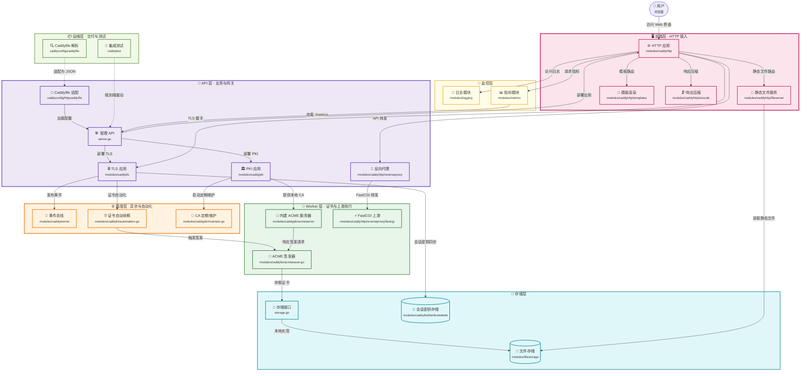
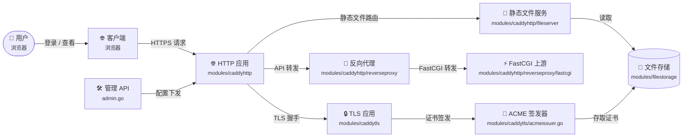

# Block Diagram — 分层模块图

> Caddy 是一个模块化的 Go Web 服务器：HTTP 应用 + TLS/证书自动化 + 本地 PKI，
> 全部通过统一的模块系统（`caddy.RegisterModule`）注册与装配。

## 子图1：分层全景 — 模块化 Web 服务器架构

```mermaid
flowchart TB
    actor_user(["🧑 用户<br/><small>浏览器</small>"])
    actor_user -->|"访问 Web 界面"| http
    subgraph L_frontend["🖥️ 前端层 · HTTP 接入"]
        direction LR
        http["🌐 HTTP 应用<br/><small>modules/caddyhttp</small>"]
        fileserver["📄 静态文件服务<br/><small>modules/caddyhttp/fileserver</small>"]
        templates["🎨 模板渲染<br/><small>modules/caddyhttp/templates</small>"]
        encode["🗜️ 响应压缩<br/><small>modules/caddyhttp/encode</small>"]
    end

    subgraph L_api["🔌 API 层 · 业务与网关"]
        direction LR
        admin["🛠️ 管理 API<br/><small>admin.go</small>"]
        adapter["📝 Caddyfile 适配<br/><small>caddyconfig/httpcaddyfile</small>"]
        reverseproxy["🔀 反向代理<br/><small>modules/caddyhttp/reverseproxy</small>"]
        tls["🔒 TLS 应用<br/><small>modules/caddytls</small>"]
        pki["🏛️ PKI 应用<br/><small>modules/caddypki</small>"]
    end

    subgraph L_schedule["⚙️ 调度层 · 异步与自动化"]
        direction LR
        events["📢 事件总线<br/><small>modules/caddyevents</small>"]
        automation["⏰ 证书自动续期<br/><small>modules/caddytls/automation.go</small>"]
        maintain["🧹 CA 定期维护<br/><small>modules/caddypki/maintain.go</small>"]
    end

    subgraph L_worker["🧩 Worker 层 · 证书与上游执行"]
        direction LR
        acmeissuer["🎫 ACME 签发器<br/><small>modules/caddytls/acmeissuer.go</small>"]
        acmeserver["🏢 内建 ACME 服务器<br/><small>modules/caddypki/acmeserver</small>"]
        fastcgi["⚡ FastCGI 上游<br/><small>modules/caddyhttp/reverseproxy/fastcgi</small>"]
    end

    subgraph L_storage["💾 存储层"]
        direction LR
        filestorage[("💾 文件存储<br/><small>modules/filestorage</small>")]
        storage_if["🔌 存储接口<br/><small>storage.go</small>"]
        stek[("🔑 会话密钥存储<br/><small>modules/caddytls/distributedstek</small>")]
    end

    subgraph L_monitor["🔔 监控层"]
        direction LR
        logging["📝 日志模块<br/><small>modules/logging</small>"]
        metrics["📊 指标模块<br/><small>modules/metrics</small>"]
    end

    subgraph L_ops["📦 运维层 · 交付与测试"]
        direction LR
        parser["🔍 Caddyfile 解析<br/><small>caddyconfig/caddyfile</small>"]
        caddytest["🧪 集成测试<br/><small>caddytest</small>"]
    end

    parser -.->|"适配为 JSON"| adapter
    adapter -->|"加载配置"| admin
    caddytest -.->|"端到端驱动"| admin

    admin -->|"部署应用"| http
    admin -->|"部署 TLS"| tls
    admin -->|"部署 PKI"| pki
    http -->|"静态文件路由"| fileserver
    http -->|"模板路由"| templates
    http -->|"响应压缩"| encode
    http -->|"API 转发"| reverseproxy
    http -->|"TLS 握手"| tls

    reverseproxy -->|"FastCGI 转发"| fastcgi
    tls -->|"证书自动化"| automation
    tls -->|"发布事件"| events
    pki -->|"启动定期维护"| maintain

    automation -->|"触发签发"| acmeissuer
    pki -->|"提供本地 CA"| acmeserver
    acmeserver -->|"响应签发请求"| acmeissuer

    acmeissuer -->|"存取证书"| storage_if
    storage_if -->|"本地实现"| filestorage
    fileserver -->|"读取静态文件"| filestorage
    tls -->|"会话密钥同步"| stek

    http -->|"访问日志"| logging
    http -->|"请求指标"| metrics
    metrics -->|"挂载 /metrics"| admin

    classDef fe fill:#fce4ec,stroke:#c2185b,stroke-width:2px
    classDef api fill:#ede7f6,stroke:#5e35b1,stroke-width:2px
    classDef sch fill:#fff3e0,stroke:#ef6c00,stroke-width:2px
    classDef wkr fill:#e8f5e9,stroke:#2e7d32,stroke-width:2px
    classDef sto fill:#e0f7fa,stroke:#00838f,stroke-width:2px
    classDef mon fill:#fffde7,stroke:#f9a825,stroke-width:2px
    classDef ops fill:#f1f8e9,stroke:#558b2f,stroke-width:2px

    class http,fileserver,templates,encode fe
    class admin,adapter,reverseproxy,tls,pki api
    class events,automation,maintain sch
    class acmeissuer,acmeserver,fastcgi wkr
    class filestorage,storage_if,stek sto
    class logging,metrics mon
    class parser,caddytest ops

    style L_frontend fill:#fce4ec,stroke:#c2185b,stroke-width:3px
    style L_api fill:#ede7f6,stroke:#5e35b1,stroke-width:2.5px
    style L_schedule fill:#fff3e0,stroke:#ef6c00,stroke-width:2.5px
    style L_worker fill:#e8f5e9,stroke:#2e7d32,stroke-width:2px
    style L_storage fill:#e0f7fa,stroke:#00838f,stroke-width:2px
    style L_monitor fill:#fffde7,stroke:#f9a825,stroke-width:2px
    style L_ops fill:#f1f8e9,stroke:#558b2f,stroke-width:2px
```

## 子图2：主请求链路（LR）

```mermaid
flowchart LR
    actor_user(["🧑 用户<br/><small>浏览器</small>"])
    actor_user -->|"登录 / 查看"| client
    client["🌐 客户端<br/><small>浏览器</small>"] -->|"HTTPS 请求"| http["🌐 HTTP 应用<br/><small>modules/caddyhttp</small>"]
    http -->|"静态文件路由"| fileserver["📄 静态文件服务<br/><small>modules/caddyhttp/fileserver</small>"]
    http -->|"API 转发"| reverseproxy["🔀 反向代理<br/><small>modules/caddyhttp/reverseproxy</small>"]
    fileserver -->|"读取"| store[("💾 文件存储<br/><small>modules/filestorage</small>")]
    reverseproxy -->|"FastCGI 转发"| fastcgi["⚡ FastCGI 上游<br/><small>modules/caddyhttp/reverseproxy/fastcgi</small>"]
    http -->|"TLS 握手"| tls["🔒 TLS 应用<br/><small>modules/caddytls</small>"]
    tls -->|"证书签发"| acme["🎫 ACME 签发器<br/><small>modules/caddytls/acmeissuer.go</small>"]
    acme -->|"存取证书"| store
    admin["🛠️ 管理 API<br/><small>admin.go</small>"] -->|"配置下发"| http
```
