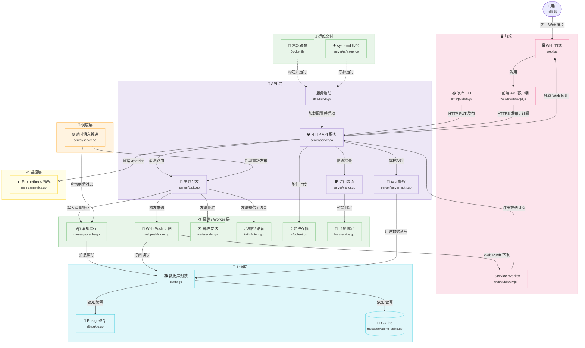
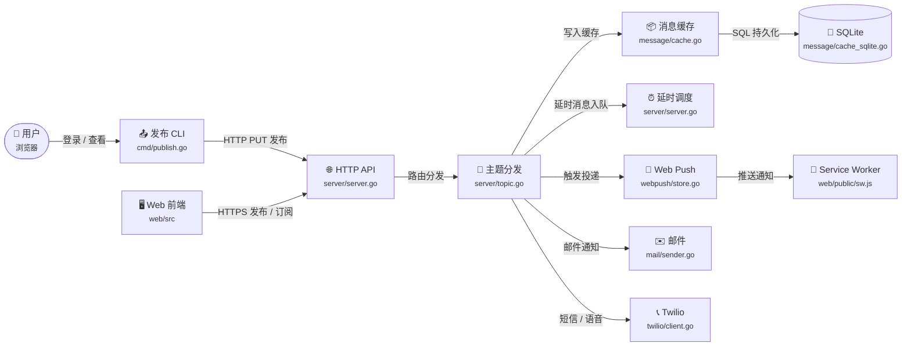

# Block Diagram — 分层模块图

> ntfy 是一个用 Go 编写的自托管 pub/sub 推送通知服务器：通过 HTTP API 发布消息，
> 经主题分发与消息缓存后，以 Web Push / 邮件 / 短信 / 语音等方式投递到订阅端。

## 子图1：分层全景

```mermaid
flowchart TB
    actor_user(["🧑 用户<br/><small>浏览器</small>"])
    actor_user -->|"访问 Web 界面"| fe_webapp
    subgraph L_frontend["🖥️ 前端"]
        fe_webapp["🖥️ Web 前端<br/><small>web/src</small>"]
        fe_sw["📳 Service Worker<br/><small>web/public/sw.js</small>"]
        fe_api["🔌 前端 API 客户端<br/><small>web/src/app/Api.js</small>"]
        fe_cli["📤 发布 CLI<br/><small>cmd/publish.go</small>"]
    end

    subgraph L_api["🧩 API 层"]
        api_serve["🚀 服务启动<br/><small>cmd/serve.go</small>"]
        api_http["🌐 HTTP API 服务<br/><small>server/server.go</small>"]
        api_topic["📢 主题分发<br/><small>server/topic.go</small>"]
        api_visitor["🛡️ 访问限流<br/><small>server/visitor.go</small>"]
        api_auth["🔑 认证鉴权<br/><small>server/server_auth.go</small>"]
    end

    subgraph L_schedule["⏰ 调度层"]
        sched_delayed["⏰ 延时消息投递<br/><small>server/server.go</small>"]
    end

    subgraph L_worker["⚙️ 投递 / Worker 层"]
        worker_cache["📦 消息缓存<br/><small>message/cache.go</small>"]
        worker_push["🔔 Web Push 订阅<br/><small>webpush/store.go</small>"]
        worker_mail["✉️ 邮件发送<br/><small>mail/sender.go</small>"]
        worker_sms["📞 短信 / 语音<br/><small>twilio/client.go</small>"]
        worker_s3["🗄️ 附件存储<br/><small>s3/client.go</small>"]
        worker_ban["🚫 封禁判定<br/><small>ban/service.go</small>"]
    end

    subgraph L_storage["💾 存储层"]
        store_db["🗃️ 数据库封装<br/><small>db/db.go</small>"]
        store_pg["🐘 PostgreSQL<br/><small>db/pg/pg.go</small>"]
        store_sqlite[("💾 SQLite<br/><small>message/cache_sqlite.go</small>")]
    end

    subgraph L_monitor["📈 监控层"]
        mon_metrics["📊 Prometheus 指标<br/><small>metrics/metrics.go</small>"]
    end

    subgraph L_ops["🚀 运维交付"]
        ops_docker["🐳 容器镜像<br/><small>Dockerfile</small>"]
        ops_systemd["⚙️ systemd 服务<br/><small>server/ntfy.service</small>"]
    end

    fe_cli -->|"HTTP PUT 发布"| api_http
    fe_webapp -->|"调用"| fe_api
    fe_api -->|"HTTPS 发布 / 订阅"| api_http
    fe_sw -->|"注册推送订阅"| api_http
    api_http -->|"托管 Web 应用"| fe_webapp
    api_serve -->|"加载配置并启动"| api_http
    api_http -->|"鉴权校验"| api_auth
    api_http -->|"限流检查"| api_visitor
    api_visitor -->|"封禁判定"| worker_ban
    api_http -->|"消息路由"| api_topic
    api_topic -->|"写入消息缓存"| worker_cache
    sched_delayed -->|"查询到期消息"| worker_cache
    sched_delayed -->|"到期重新发布"| api_topic
    api_topic -->|"触发推送"| worker_push
    worker_push -->|"Web Push 下发"| fe_sw
    api_topic -->|"发送邮件"| worker_mail
    api_topic -->|"发送短信 / 语音"| worker_sms
    api_http -->|"附件上传"| worker_s3
    worker_cache -->|"消息读写"| store_db
    worker_push -->|"订阅读写"| store_db
    api_auth -->|"用户数据读写"| store_db
    store_db -->|"SQL 读写"| store_sqlite
    store_db -->|"SQL 读写"| store_pg
    api_http -->|"暴露 /metrics"| mon_metrics
    ops_docker -.->|"构建并运行"| api_serve
    ops_systemd -.->|"守护运行"| api_serve

    classDef frontend fill:#fce4ec,stroke:#f48fb1,color:#333
    classDef api fill:#ede7f6,stroke:#b39ddb,color:#333
    classDef schedule fill:#fff3e0,stroke:#ffb74d,color:#333
    classDef worker fill:#e8f5e9,stroke:#81c784,color:#333
    classDef storage fill:#e0f7fa,stroke:#4dd0e1,color:#333
    classDef monitor fill:#fffde7,stroke:#fdd835,color:#333
    classDef ops fill:#e8f5e9,stroke:#81c784,color:#333

    class fe_webapp,fe_sw,fe_api,fe_cli frontend
    class api_serve,api_http,api_topic,api_visitor,api_auth api
    class sched_delayed schedule
    class worker_cache,worker_push,worker_mail,worker_sms,worker_s3,worker_ban worker
    class store_db,store_pg,store_sqlite storage
    class mon_metrics monitor
    class ops_docker,ops_systemd ops

    style L_frontend fill:#fce4ec,stroke:#f48fb1
    style L_api fill:#ede7f6,stroke:#b39ddb
    style L_schedule fill:#fff3e0,stroke:#ffb74d
    style L_worker fill:#e8f5e9,stroke:#81c784
    style L_storage fill:#e0f7fa,stroke:#4dd0e1
    style L_monitor fill:#fffde7,stroke:#fdd835
    style L_ops fill:#e8f5e9,stroke:#81c784
```

## 子图2：发布 → 投递主链路

```mermaid
flowchart LR
    actor_user(["🧑 用户<br/><small>浏览器</small>"])
    actor_user -->|"登录 / 查看"| fe_cli
    fe_cli["📤 发布 CLI<br/><small>cmd/publish.go</small>"] -->|"HTTP PUT 发布"| api_http["🌐 HTTP API<br/><small>server/server.go</small>"]
    fe_webapp["🖥️ Web 前端<br/><small>web/src</small>"] -->|"HTTPS 发布 / 订阅"| api_http
    api_http -->|"路由分发"| api_topic["📢 主题分发<br/><small>server/topic.go</small>"]
    api_topic -->|"写入缓存"| worker_cache["📦 消息缓存<br/><small>message/cache.go</small>"]
    worker_cache -->|"SQL 持久化"| store_sqlite[("💾 SQLite<br/><small>message/cache_sqlite.go</small>")]
    api_topic -->|"延时消息入队"| sched_delayed["⏰ 延时调度<br/><small>server/server.go</small>"]
    api_topic -->|"触发投递"| worker_push["🔔 Web Push<br/><small>webpush/store.go</small>"]
    worker_push -->|"推送通知"| fe_sw["📳 Service Worker<br/><small>web/public/sw.js</small>"]
    api_topic -->|"邮件通知"| worker_mail["✉️ 邮件<br/><small>mail/sender.go</small>"]
    api_topic -->|"短信 / 语音"| worker_sms["📞 Twilio<br/><small>twilio/client.go</small>"]
```
