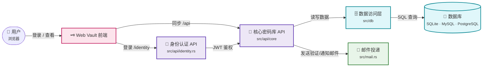

# Block Diagram — 分层模块图

> Vaultwarden（Rust 实现的 Bitwarden 服务器）技术分层：前端 → API → 调度 → Worker → 存储 → 监控 → 运维。

## 子图1：分层全景

```mermaid
flowchart TB
    actor_user(["🧑 用户<br/><small>浏览器</small>"])
    actor_user -->|"访问 Web 界面"| FE_ADMIN
    subgraph L_frontend["🖥️ 前端"]
        direction LR
        FE_VAULT["🗝️ Web Vault 前端<br/><small>web-vault 官方静态包</small>"]
        FE_ADMIN["🛠️ 管理后台界面<br/><small>src/static/templates/admin</small>"]
    end

    subgraph L_api["🔌 API 服务层"]
        direction LR
        API_CORE["🔐 核心密码库 API<br/><small>src/api/core</small>"]
        API_IDENTITY["🎫 身份认证 API<br/><small>src/api/identity.rs</small>"]
        API_ADMIN["⚙️ 管理后台 API<br/><small>src/api/admin.rs</small>"]
        API_WEB["📄 网页与静态路由<br/><small>src/api/web.rs</small>"]
        API_ICONS["🧭 网站图标 API<br/><small>src/api/icons.rs</small>"]
        AUTH["🛂 鉴权模块 JWT/2FA<br/><small>src/auth.rs</small>"]
    end

    subgraph L_schedule["⏰ 调度层"]
        SCHED["⏰ 定时任务调度器<br/><small>src/main.rs</small>"]
    end

    subgraph L_worker["⚙️ Worker 异步任务"]
        direction LR
        MAIL["📧 邮件投递 SMTP<br/><small>src/mail.rs</small>"]
        PUSH["📲 移动端推送<br/><small>src/api/push.rs</small>"]
        WS["🔔 WebSocket 实时通知<br/><small>src/api/notifications.rs</small>"]
        HTTP["🌐 外呼 HTTP 客户端<br/><small>src/http_client.rs</small>"]
    end

    subgraph L_storage["💾 存储层"]
        direction LR
        ORM["🗄️ 数据访问层 Diesel<br/><small>src/db</small>"]
        DB[("💾 数据库引擎<br/><small>SQLite · MySQL · PostgreSQL</small>")]
        ATTACH["📎 附件/发送文件存储<br/><small>src/storage.rs</small>"]
        MIGR["🧬 数据库迁移脚本<br/><small>migrations</small>"]
    end

    subgraph L_monitor["📊 监控层"]
        direction LR
        ALIVE["💓 健康检查端点 /alive<br/><small>src/api/core/mod.rs</small>"]
        QLOG["🐢 慢查询日志<br/><small>src/db/query_logger.rs</small>"]
        LOG["📝 请求访问日志<br/><small>src/util.rs</small>"]
    end

    subgraph L_ops["📦 运维交付"]
        direction LR
        START["🚀 容器启动脚本<br/><small>docker/start.sh</small>"]
        HC["🩺 容器健康检查<br/><small>docker/healthcheck.sh</small>"]
        E2E["🧪 端到端测试<br/><small>playwright</small>"]
    end

    API_WEB -->|"下发页面与静态资源"| FE_VAULT
    FE_VAULT -->|"登录 /identity"| API_IDENTITY
    FE_VAULT -->|"密码库同步 /api"| API_CORE
    API_ADMIN -->|"渲染后台页面"| FE_ADMIN
    API_IDENTITY -->|"签发/校验 JWT"| AUTH
    API_CORE -->|"鉴权拦截"| AUTH
    API_ADMIN -->|"鉴权拦截"| AUTH

    SCHED -->|"定时清理/超时任务"| ORM
    SCHED -->|"触发提醒邮件"| MAIL

    API_CORE -->|"发送邮件"| MAIL
    API_CORE -->|"数据变更推送"| PUSH
    API_CORE -->|"实时事件广播"| WS
    WS -->|"WebSocket 实时推送"| FE_VAULT
    API_ICONS -->|"抓取网站图标"| HTTP

    API_CORE -->|"上传/下载附件"| ATTACH
    API_CORE -->|"读写业务数据"| ORM
    API_ADMIN -->|"读写运维数据"| ORM
    ORM -->|"SQL 查询"| DB
    MIGR -->|"建表与升级"| DB

    ALIVE -->|"SELECT 1 探活"| ORM
    ORM -.->|"慢查询采集"| QLOG
    API_WEB -.->|"访问日志"| LOG

    START -.->|"启动服务进程"| SCHED
    HC -.->|"GET /alive"| ALIVE
    E2E -.->|"E2E 回归测试"| API_CORE

    classDef fe fill:#fce4ec,stroke:#c2185b,stroke-width:2px
    classDef api fill:#ede7f6,stroke:#5e35b1,stroke-width:2px
    classDef sch fill:#fff3e0,stroke:#ef6c00,stroke-width:2px
    classDef wk fill:#e8f5e9,stroke:#2e7d32,stroke-width:2px
    classDef st fill:#e0f7fa,stroke:#00838f,stroke-width:2px
    classDef mon fill:#fffde7,stroke:#f9a825,stroke-width:2px
    classDef ops fill:#e8f5e9,stroke:#2e7d32,stroke-width:2px

    class FE_VAULT,FE_ADMIN fe
    class API_CORE,API_IDENTITY,API_ADMIN,API_WEB,API_ICONS,AUTH api
    class SCHED sch
    class MAIL,PUSH,WS,HTTP wk
    class ORM,DB,ATTACH,MIGR st
    class ALIVE,QLOG,LOG mon
    class START,HC,E2E ops

    style L_frontend fill:#fce4ec,stroke:#c2185b,stroke-width:2.5px
    style L_api fill:#ede7f6,stroke:#5e35b1,stroke-width:2.5px
    style L_schedule fill:#fff3e0,stroke:#ef6c00,stroke-width:2.5px
    style L_worker fill:#e8f5e9,stroke:#2e7d32,stroke-width:2.5px
    style L_storage fill:#e0f7fa,stroke:#00838f,stroke-width:2.5px
    style L_monitor fill:#fffde7,stroke:#f9a825,stroke-width:2.5px
    style L_ops fill:#e8f5e9,stroke:#2e7d32,stroke-width:2.5px
```

## 子图2：登录与同步主链路

```mermaid
flowchart LR
    actor_user(["🧑 用户<br/><small>浏览器</small>"])
    actor_user -->|"登录 / 查看"| P_FE
    P_FE["🗝️ Web Vault 前端"]
    P_ID["🎫 身份认证 API<br/><small>src/api/identity.rs</small>"]
    P_CORE["🔐 核心密码库 API<br/><small>src/api/core</small>"]
    P_ORM["🗄️ 数据访问层<br/><small>src/db</small>"]
    P_DB[("💾 数据库<br/><small>SQLite · MySQL · PostgreSQL</small>")]
    P_MAIL["📧 邮件投递<br/><small>src/mail.rs</small>"]

    P_FE -->|"登录 /identity"| P_ID
    P_FE -->|"同步 /api"| P_CORE
    P_ID -->|"JWT 鉴权"| P_CORE
    P_CORE -->|"读写数据"| P_ORM
    P_ORM -->|"SQL 查询"| P_DB
    P_CORE -->|"发送验证/通知邮件"| P_MAIL

    classDef pfe fill:#fce4ec,stroke:#c2185b,stroke-width:2px
    classDef papi fill:#ede7f6,stroke:#5e35b1,stroke-width:2px
    classDef pst fill:#e0f7fa,stroke:#00838f,stroke-width:2px
    classDef pwk fill:#e8f5e9,stroke:#2e7d32,stroke-width:2px

    class P_FE pfe
    class P_ID,P_CORE papi
    class P_ORM,P_DB pst
    class P_MAIL pwk
```
