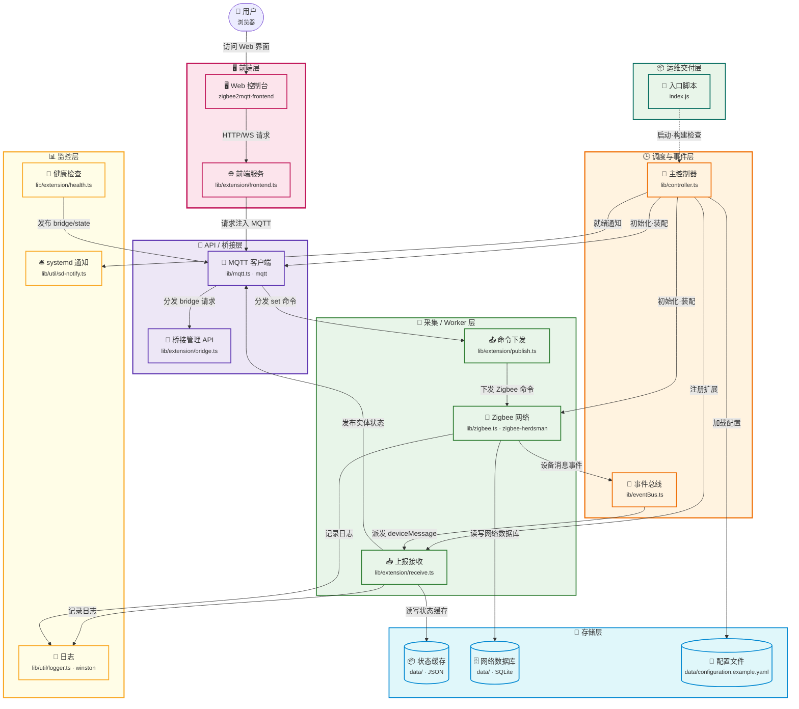

# Block Diagram — 分层模块图

> Zigbee2MQTT：Zigbee ↔ MQTT 桥接器。本图按运行时数据流分层展示：前端 → MQTT/桥接 API → 事件调度 → 扩展 Worker → 存储 → 监控 → 运维交付。

## 子图1：分层全景

```mermaid
flowchart TB
    actor_user(["🧑 用户<br/><small>浏览器</small>"])
    actor_user -->|"访问 Web 界面"| web_ui
    subgraph L_frontend["🖥️ 前端层"]
        web_ui["🖥️ Web 控制台<br/><small>zigbee2mqtt-frontend</small>"]
        ext_frontend["🌐 前端服务<br/><small>lib/extension/frontend.ts</small>"]
    end

    subgraph L_api["💜 API / 桥接层"]
        mqtt_client["📡 MQTT 客户端<br/><small>lib/mqtt.ts · mqtt</small>"]
        bridge_api["🌉 桥接管理 API<br/><small>lib/extension/bridge.ts</small>"]
    end

    subgraph L_schedule["🕒 调度与事件层"]
        controller["🧭 主控制器<br/><small>lib/controller.ts</small>"]
        event_bus["🔄 事件总线<br/><small>lib/eventBus.ts</small>"]
    end

    subgraph L_worker["🧩 采集 / Worker 层"]
        zigbee["🔌 Zigbee 网络<br/><small>lib/zigbee.ts · zigbee-herdsman</small>"]
        ext_receive["📥 上报接收<br/><small>lib/extension/receive.ts</small>"]
        ext_publish["📤 命令下发<br/><small>lib/extension/publish.ts</small>"]
    end

    subgraph L_storage["💾 存储层"]
        st_state[("📦 状态缓存<br/><small>data/ · JSON</small>")]
        st_db[("🗄️ 网络数据库<br/><small>data/ · SQLite</small>")]
        st_cfg[("📄 配置文件<br/><small>data/configuration.example.yaml</small>")]
    end

    subgraph L_monitor["📊 监控层"]
        ext_health["💓 健康检查<br/><small>lib/extension/health.ts</small>"]
        logger["📝 日志<br/><small>lib/util/logger.ts · winston</small>"]
        sd_notify["🛎️ systemd 通知<br/><small>lib/util/sd-notify.ts</small>"]
    end

    subgraph L_ops["📦 运维交付层"]
        entry["🚀 入口脚本<br/><small>index.js</small>"]
    end

    entry -.->|"启动·构建检查"| controller
    controller -->|"初始化·装配"| mqtt_client
    controller -->|"初始化·装配"| zigbee
    controller -->|"注册扩展"| ext_receive
    controller -->|"加载配置"| st_cfg
    controller -->|"就绪通知"| sd_notify

    web_ui -->|"HTTP/WS 请求"| ext_frontend
    ext_frontend -->|"请求注入 MQTT"| mqtt_client
    mqtt_client -->|"分发 bridge 请求"| bridge_api

    mqtt_client -->|"分发 set 命令"| ext_publish
    ext_publish -->|"下发 Zigbee 命令"| zigbee
    zigbee -->|"设备消息事件"| event_bus
    event_bus -->|"派发 deviceMessage"| ext_receive
    ext_receive -->|"发布实体状态"| mqtt_client
    ext_receive -->|"读写状态缓存"| st_state
    ext_receive -->|"记录日志"| logger
    zigbee -->|"读写网络数据库"| st_db
    zigbee -->|"记录日志"| logger
    ext_health -->|"发布 bridge/state"| mqtt_client

    classDef fe fill:#fce4ec,stroke:#c2185b,stroke-width:2px
    classDef api fill:#ede7f6,stroke:#5e35b1,stroke-width:2px
    classDef sch fill:#fff3e0,stroke:#ef6c00,stroke-width:2px
    classDef wk fill:#e8f5e9,stroke:#2e7d32,stroke-width:2px
    classDef st fill:#e0f7fa,stroke:#0288d1,stroke-width:2px
    classDef mon fill:#fffde7,stroke:#f9a825,stroke-width:2px
    classDef ops fill:#e8f5e9,stroke:#00695c,stroke-width:2px

    class web_ui,ext_frontend fe
    class mqtt_client,bridge_api api
    class controller,event_bus sch
    class zigbee,ext_receive,ext_publish wk
    class st_state,st_db,st_cfg st
    class ext_health,logger,sd_notify mon
    class entry ops

    style L_frontend fill:#fce4ec,stroke:#c2185b,stroke-width:3px
    style L_api fill:#ede7f6,stroke:#5e35b1,stroke-width:2.5px
    style L_schedule fill:#fff3e0,stroke:#ef6c00,stroke-width:2.5px
    style L_worker fill:#e8f5e9,stroke:#2e7d32,stroke-width:2px
    style L_storage fill:#e0f7fa,stroke:#0288d1,stroke-width:2px
    style L_monitor fill:#fffde7,stroke:#f9a825,stroke-width:2.5px
    style L_ops fill:#e8f5e9,stroke:#00695c,stroke-width:2px
```

## 子图2：主链路数据流

```mermaid
flowchart LR
    actor_user(["🧑 用户<br/><small>浏览器</small>"])
    actor_user -->|"登录 / 查看"| ext_frontend
    subgraph L_main["🔀 主链路：Web 控制 → Zigbee 执行 → 状态回传"]
        web_ui["🖥️ Web 控制台<br/><small>zigbee2mqtt-frontend</small>"]
        ext_frontend["🌐 前端服务<br/><small>lib/extension/frontend.ts</small>"]
        mqtt_client["📡 MQTT 客户端<br/><small>lib/mqtt.ts</small>"]
        ext_publish["📤 命令下发<br/><small>lib/extension/publish.ts</small>"]
        zigbee["🔌 Zigbee 网络<br/><small>lib/zigbee.ts</small>"]
        event_bus["🔄 事件总线<br/><small>lib/eventBus.ts</small>"]
        ext_receive["📥 上报接收<br/><small>lib/extension/receive.ts</small>"]
        st_state[("📦 状态缓存<br/><small>data/ · JSON</small>")]

        web_ui -->|"操作请求"| ext_frontend
        ext_frontend -->|"注入 MQTT"| mqtt_client
        mqtt_client -->|"set 命令"| ext_publish
        ext_publish -->|"Zigbee 命令"| zigbee
        zigbee -->|"设备上报"| event_bus
        event_bus -->|"派发消息"| ext_receive
        ext_receive -->|"状态缓存"| st_state
        ext_receive -->|"状态发布"| mqtt_client
        mqtt_client -->|"状态推送"| ext_frontend
        ext_frontend -->|"WS 推送"| web_ui
    end

    classDef fe fill:#fce4ec,stroke:#c2185b,stroke-width:2px
    classDef api fill:#ede7f6,stroke:#5e35b1,stroke-width:2px
    classDef sch fill:#fff3e0,stroke:#ef6c00,stroke-width:2px
    classDef wk fill:#e8f5e9,stroke:#2e7d32,stroke-width:2px
    classDef st fill:#e0f7fa,stroke:#0288d1,stroke-width:2px

    class web_ui,ext_frontend fe
    class mqtt_client api
    class event_bus sch
    class ext_publish,zigbee,ext_receive wk
    class st_state st

    style L_main fill:#f3e5f5,stroke:#7b1fa2,stroke-width:2.5px
```
